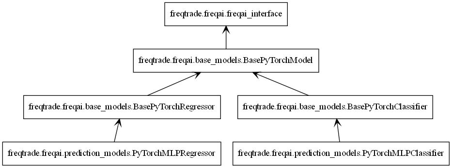

# Configuration

FreqAI is configured through the typical [Freqtrade config file](configuration.md) and the standard [Freqtrade strategy](strategy-customization.md). Examples of FreqAI config and strategy files can be found in `config_examples/config_freqai.example.json` and `freqtrade/templates/FreqaiExampleStrategy.py`, respectively.

## Setting up the configuration file

 Although there are plenty of additional parameters to choose from, as highlighted in the [parameter table](freqai-parameter-table.md#parameter-table), a FreqAI config must at minimum include the following parameters (the parameter values are only examples):

```json
    "freqai": {
        "enabled": true,
        "purge_old_models": 2,
        "train_period_days": 30,
        "backtest_period_days": 7,
        "identifier" : "unique-id",
        "feature_parameters" : {
            "include_timeframes": ["5m","15m","4h"],
            "include_corr_pairlist": [
                "ETH/USD",
                "LINK/USD",
                "BNB/USD"
            ],
            "label_period_candles": 24,
            "include_shifted_candles": 2,
            "indicator_periods_candles": [10, 20]
        },
        "data_split_parameters" : {
            "test_size": 0.25
        }
    }
```

A full example config is available in `config_examples/config_freqai.example.json`.

## Building a FreqAI strategy

The FreqAI strategy requires including the following lines of code in the standard [Freqtrade strategy](strategy-customization.md):

```python
    # user should define the maximum startup candle count (the largest number of candles
    # passed to any single indicator)
    startup_candle_count: int = 20

    def populate_indicators(self, dataframe: DataFrame, metadata: dict) -> DataFrame:

        # the model will return all labels created by user in `set_freqai_targets()`
        # (& appended targets), an indication of whether or not the prediction should be accepted,
        # the target mean/std values for each of the labels created by user in
        # `set_freqai_targets()` for each training period.

        dataframe = self.freqai.start(dataframe, metadata, self)

        return dataframe

    def feature_engineering_expand_all(self, dataframe: DataFrame, period, **kwargs) -> DataFrame:
        """
        *Only functional with FreqAI enabled strategies*
        This function will automatically expand the defined features on the config defined
        `indicator_periods_candles`, `include_timeframes`, `include_shifted_candles`, and
        `include_corr_pairs`. In other words, a single feature defined in this function
        will automatically expand to a total of
        `indicator_periods_candles` * `include_timeframes` * `include_shifted_candles` *
        `include_corr_pairs` numbers of features added to the model.

        All features must be prepended with `%` to be recognized by FreqAI internals.

        :param df: strategy dataframe which will receive the features
        :param period: period of the indicator - usage example:
        dataframe["%-ema-period"] = ta.EMA(dataframe, timeperiod=period)
        """

        dataframe["%-rsi-period"] = ta.RSI(dataframe, timeperiod=period)
        dataframe["%-mfi-period"] = ta.MFI(dataframe, timeperiod=period)
        dataframe["%-adx-period"] = ta.ADX(dataframe, timeperiod=period)
        dataframe["%-sma-period"] = ta.SMA(dataframe, timeperiod=period)
        dataframe["%-ema-period"] = ta.EMA(dataframe, timeperiod=period)

        return dataframe

    def feature_engineering_expand_basic(self, dataframe: DataFrame, **kwargs) -> DataFrame:
        """
        *Only functional with FreqAI enabled strategies*
        This function will automatically expand the defined features on the config defined
        `include_timeframes`, `include_shifted_candles`, and `include_corr_pairs`.
        In other words, a single feature defined in this function
        will automatically expand to a total of
        `include_timeframes` * `include_shifted_candles` * `include_corr_pairs`
        numbers of features added to the model.

        Features defined here will *not* be automatically duplicated on user defined
        `indicator_periods_candles`

        All features must be prepended with `%` to be recognized by FreqAI internals.

        :param df: strategy dataframe which will receive the features
        dataframe["%-pct-change"] = dataframe["close"].pct_change()
        dataframe["%-ema-200"] = ta.EMA(dataframe, timeperiod=200)
        """
        dataframe["%-pct-change"] = dataframe["close"].pct_change()
        dataframe["%-raw_volume"] = dataframe["volume"]
        dataframe["%-raw_price"] = dataframe["close"]
        return dataframe

    def feature_engineering_standard(self, dataframe: DataFrame, **kwargs) -> DataFrame:
        """
        *Only functional with FreqAI enabled strategies*
        This optional function will be called once with the dataframe of the base timeframe.
        This is the final function to be called, which means that the dataframe entering this
        function will contain all the features and columns created by all other
        freqai_feature_engineering_* functions.

        This function is a good place to do custom exotic feature extractions (e.g. tsfresh).
        This function is a good place for any feature that should not be auto-expanded upon
        (e.g. day of the week).

        All features must be prepended with `%` to be recognized by FreqAI internals.

        :param df: strategy dataframe which will receive the features
        usage example: dataframe["%-day_of_week"] = (dataframe["date"].dt.dayofweek + 1) / 7
        """
        dataframe["%-day_of_week"] = (dataframe["date"].dt.dayofweek + 1) / 7
        dataframe["%-hour_of_day"] = (dataframe["date"].dt.hour + 1) / 25
        return dataframe

    def set_freqai_targets(self, dataframe: DataFrame, **kwargs) -> DataFrame:
        """
        *Only functional with FreqAI enabled strategies*
        Required function to set the targets for the model.
        All targets must be prepended with `&` to be recognized by the FreqAI internals.

        :param df: strategy dataframe which will receive the targets
        usage example: dataframe["&-target"] = dataframe["close"].shift(-1) / dataframe["close"]
        """
        dataframe["&-s_close"] = (
            dataframe["close"]
            .shift(-self.freqai_info["feature_parameters"]["label_period_candles"])
            .rolling(self.freqai_info["feature_parameters"]["label_period_candles"])
            .mean()
            / dataframe["close"]
            - 1
            )
        return dataframe
```

Notice how the `feature_engineering_*()` is where [features](freqai-feature-engineering.md#feature-engineering) are added. Meanwhile `set_freqai_targets()` adds the labels/targets. A full example strategy is available in `templates/FreqaiExampleStrategy.py`.

!!! Note
    The `self.freqai.start()` function cannot be called outside the `populate_indicators()`.

!!! Note
    Features **must** be defined in `feature_engineering_*()`. Defining FreqAI features in `populate_indicators()`
    will cause the algorithm to fail in live/dry mode. In order to add generalized features that are not associated with a specific pair or timeframe, you should use `feature_engineering_standard()`
    (as exemplified in `freqtrade/templates/FreqaiExampleStrategy.py`).

## Important dataframe key patterns

Below are the values you can expect to include/use inside a typical strategy dataframe (`df[]`):

|  DataFrame Key | Description |
|------------|-------------|
| `df['&*']` | Any dataframe column prepended with `&` in `set_freqai_targets()` is treated as a training target (label) inside FreqAI (typically following the naming convention `&-s*`). For example, to predict the close price 40 candles into the future, you would set `df['&-s_close'] = df['close'].shift(-self.freqai_info["feature_parameters"]["label_period_candles"])` with `"label_period_candles": 40` in the config. FreqAI makes the predictions and gives them back under the same key (`df['&-s_close']`) to be used in `populate_entry/exit_trend()`. <br> **Datatype:** Depends on the output of the model.
| `df['&*_std/mean']` | Standard deviation and mean values of the defined labels during training (or live tracking with `fit_live_predictions_candles`). Commonly used to understand the rarity of a prediction (use the z-score as shown in `templates/FreqaiExampleStrategy.py` and explained [here](#creating-a-dynamic-target-threshold) to evaluate how often a particular prediction was observed during training or historically with `fit_live_predictions_candles`). <br> **Datatype:** Float.
| `df['do_predict']` | Indication of an outlier data point. The return value is integer between -2 and 2, which lets you know if the prediction is trustworthy or not. `do_predict==1` means that the prediction is trustworthy. If the Dissimilarity Index (DI, see details [here](freqai-feature-engineering.md#identifying-outliers-with-the-dissimilarity-index-di)) of the input data point is above the threshold defined in the config, FreqAI will subtract 1 from `do_predict`, resulting in `do_predict==0`. If `use_SVM_to_remove_outliers` is active, the Support Vector Machine (SVM, see details [here](freqai-feature-engineering.md#identifying-outliers-using-a-support-vector-machine-svm)) may also detect outliers in training and prediction data. In this case, the SVM will also subtract 1 from `do_predict`. If the input data point was considered an outlier by the SVM but not by the DI, or vice versa, the result will be `do_predict==0`. If both the DI and the SVM considers the input data point to be an outlier, the result will be `do_predict==-1`. As with the SVM, if `use_DBSCAN_to_remove_outliers` is active, DBSCAN (see details [here](freqai-feature-engineering.md#identifying-outliers-with-dbscan)) may also detect outliers and subtract 1 from `do_predict`. Hence, if both the SVM and DBSCAN are active and identify a datapoint that was above the DI threshold as an outlier, the result will be `do_predict==-2`. A particular case is when `do_predict == 2`, which means that the model has expired due to exceeding `expired_hours`. <br> **Datatype:** Integer between -2 and 2.
| `df['DI_values']` | Dissimilarity Index (DI) values are proxies for the level of confidence FreqAI has in the prediction. A lower DI means the prediction is close to the training data, i.e., higher prediction confidence. See details about the DI [here](freqai-feature-engineering.md#identifying-outliers-with-the-dissimilarity-index-di). <br> **Datatype:** Float.
| `df['%*']` | Any dataframe column prepended with `%` in `feature_engineering_*()` is treated as a training feature. For example, you can include the RSI in the training feature set (similar to in `templates/FreqaiExampleStrategy.py`) by setting `df['%-rsi']`. See more details on how this is done [here](freqai-feature-engineering.md). <br> **Note:** Since the number of features prepended with `%` can multiply very quickly (10s of thousands of features are easily engineered using the multiplictative functionality of, e.g., `include_shifted_candles` and `include_timeframes` as described in the [parameter table](freqai-parameter-table.md)), these features are removed from the dataframe that is returned from FreqAI to the strategy. To keep a particular type of feature for plotting purposes, you would prepend it with `%%` (see details below). <br> **Datatype:** Depends on the feature created by the user.
| `df['%%*']` | Any dataframe column prepended with `%%` in `feature_engineering_*()` is treated as a training feature, just the same as the above `%` prepend. However, in this case, the features are returned back to the strategy for FreqUI/plot-dataframe plotting and monitoring in Dry/Live/Backtesting <br> **Datatype:** Depends on the feature created by the user. Please note that features created in `feature_engineering_expand()` will have automatic FreqAI naming schemas depending on the expansions that you configured (i.e. `include_timeframes`, `include_corr_pairlist`, `indicators_periods_candles`, `include_shifted_candles`). So if you want to plot `%%-rsi` from `feature_engineering_expand_all()`, the final naming scheme for your plotting config would be: `%%-rsi-period_10_ETH/USDT:USDT_1h` for the `rsi` feature with `period=10`, `timeframe=1h`, and `pair=ETH/USDT:USDT` (the `:USDT` is added if you are using futures pairs). It is useful to simply add `print(dataframe.columns)` in your `populate_indicators()` after `self.freqai.start()` to see the full list of available features that are returned to the strategy for plotting purposes.

## Setting the `startup_candle_count`

The `startup_candle_count` in the FreqAI strategy needs to be set up in the same way as in the standard Freqtrade strategy (see details [here](strategy-customization.md#strategy-startup-period)). This value is used by Freqtrade to ensure that a sufficient amount of data is provided when calling the `dataprovider`, to avoid any NaNs at the beginning of the first training. You can easily set this value by identifying the longest period (in candle units) which is passed to the indicator creation functions (e.g., TA-Lib functions). In the presented example, `startup_candle_count` is 20 since this is the maximum value in `indicators_periods_candles`.

!!! Note
    There are instances where the TA-Lib functions actually require more data than just the passed `period` or else the feature dataset gets populated with NaNs. Anecdotally, multiplying the `startup_candle_count` by 2 always leads to a fully NaN free training dataset. Hence, it is typically safest to multiply the expected `startup_candle_count` by 2. Look out for this log message to confirm that the data is clean:

    ```
    2022-08-31 15:14:04 - freqtrade.freqai.data_kitchen - INFO - dropped 0 training points due to NaNs in populated dataset 4319.
    ```

## Creating a dynamic target threshold

Deciding when to enter or exit a trade can be done in a dynamic way to reflect current market conditions. FreqAI allows you to return additional information from the training of a model (more info [here](freqai-feature-engineering.md#returning-additional-info-from-training)). For example, the `&*_std/mean` return values describe the statistical distribution of the target/label *during the most recent training*. Comparing a given prediction to these values allows you to know the rarity of the prediction. In `templates/FreqaiExampleStrategy.py`, the `target_roi` and  `sell_roi` are defined to be 1.25 z-scores away from the mean which causes predictions that are closer to the mean to be filtered out.

```python
dataframe["target_roi"] = dataframe["&-s_close_mean"] + dataframe["&-s_close_std"] * 1.25
dataframe["sell_roi"] = dataframe["&-s_close_mean"] - dataframe["&-s_close_std"] * 1.25
```

To consider the population of *historical predictions* for creating the dynamic target instead of information from the training as discussed above, you would set `fit_live_predictions_candles` in the config to the number of historical prediction candles you wish to use to generate target statistics.

```json
    "freqai": {
        "fit_live_predictions_candles": 300,
    }
```

If this value is set, FreqAI will initially use the predictions from the training data and subsequently begin introducing real prediction data as it is generated. FreqAI will save this historical data to be reloaded if you stop and restart a model with the same `identifier`.

## Using different prediction models

FreqAI has multiple example prediction model libraries that are ready to be used as is via the flag `--freqaimodel`. These libraries include `CatBoost`, `LightGBM`, and `XGBoost` regression, classification, and multi-target models, and can be found in `freqai/prediction_models/`.

Regression and classification models differ in what targets they predict - a regression model will predict a target of continuous values, for example what price BTC will be at tomorrow, whilst a classifier will predict a target of discrete values, for example if the price of BTC will go up tomorrow or not. This means that you have to specify your targets differently depending on which model type you are using (see details [below](#setting-model-targets)).

All of the aforementioned model libraries implement gradient boosted decision tree algorithms. They all work on the principle of ensemble learning, where predictions from multiple simple learners are combined to get a final prediction that is more stable and generalized. The simple learners in this case are decision trees. Gradient boosting refers to the method of learning, where each simple learner is built in sequence - the subsequent learner is used to improve on the error from the previous learner. If you want to learn more about the different model libraries you can find the information in their respective docs:

* CatBoost: https://catboost.ai/en/docs/
* LightGBM: https://lightgbm.readthedocs.io/en/v3.3.2/#
* XGBoost: https://xgboost.readthedocs.io/en/stable/#

There are also numerous online articles describing and comparing the algorithms. Some relatively lightweight examples would be [CatBoost vs. LightGBM vs. XGBoost — Which is the best algorithm?](https://towardsdatascience.com/catboost-vs-lightgbm-vs-xgboost-c80f40662924#:~:text=In%20CatBoost%2C%20symmetric%20trees%2C%20or,the%20same%20depth%20can%20differ.) and [XGBoost, LightGBM or CatBoost — which boosting algorithm should I use?](https://medium.com/riskified-technology/xgboost-lightgbm-or-catboost-which-boosting-algorithm-should-i-use-e7fda7bb36bc). Keep in mind that the performance of each model is highly dependent on the application and so any reported metrics might not be true for your particular use of the model.

Apart from the models already available in FreqAI, it is also possible to customize and create your own prediction models using the `IFreqaiModel` class. You are encouraged to inherit `fit()`, `train()`, and `predict()` to customize various aspects of the training procedures. You can place custom FreqAI models in `user_data/freqaimodels` - and freqtrade will pick them up from there based on the provided `--freqaimodel` name - which has to correspond to the class name of your custom model.
Make sure to use unique names to avoid overriding built-in models.

### Setting model targets

#### Regressors

If you are using a regressor, you need to specify a target that has continuous values. FreqAI includes a variety of regressors, such as the `CatboostRegressor`via the flag `--freqaimodel CatboostRegressor`. An example of how you could set a regression target for predicting the price 100 candles into the future would be

```python
df['&s-close_price'] = df['close'].shift(-100)
```

If you want to predict multiple targets, you need to define multiple labels using the same syntax as shown above.

#### Classifiers

If you are using a classifier, you need to specify a target that has discrete values. FreqAI includes a variety of classifiers, such as the `CatboostClassifier` via the flag `--freqaimodel CatboostClassifier`. If you elects to use a classifier, the classes need to be set using strings. For example, if you want to predict if the price 100 candles into the future goes up or down you would set

```python
df['&s-up_or_down'] = np.where( df["close"].shift(-100) > df["close"], 'up', 'down')
```

If you want to predict multiple targets you must specify all labels in the same label column. You could, for example, add the label `same` to define where the price was unchanged by setting

```python
df['&s-up_or_down'] = np.where( df["close"].shift(-100) > df["close"], 'up', 'down')
df['&s-up_or_down'] = np.where( df["close"].shift(-100) == df["close"], 'same', df['&s-up_or_down'])
```

## PyTorch Module

### Quick start

The easiest way to quickly run a pytorch model is with the following command (for regression task):

```bash
freqtrade trade --config config_examples/config_freqai.example.json --strategy FreqaiExampleStrategy --freqaimodel PyTorchMLPRegressor --strategy-path freqtrade/templates 
```

!!! Note "Installation/docker"
    The PyTorch module requires large packages such as `torch`, which should be explicitly requested during `./setup.sh -i` by answering "y" to the question "Do you also want dependencies for freqai-rl or PyTorch (~700mb additional space required) [y/N]?".
    Users who prefer docker should ensure they use the docker image appended with `_freqaitorch`.
    We do provide an explicit docker-compose file for this in `docker/docker-compose-freqai.yml` - which can be used via `docker compose -f docker/docker-compose-freqai.yml run ...` - or can be copied to replace the original docker file.
    This docker-compose file also contains a (disabled) section to enable GPU resources within docker containers. This obviously assumes the system has GPU resources available.

### Structure

#### Model

You can construct your own Neural Network architecture in PyTorch by simply defining your `nn.Module` class inside your custom [`IFreqaiModel` file](#using-different-prediction-models) and then using that class in your `def train()` function. Here is an example of logistic regression model implementation using PyTorch (should be used with nn.BCELoss criterion) for classification tasks.

```python

class LogisticRegression(nn.Module):
    def __init__(self, input_size: int):
        super().__init__()
        # Define your layers
        self.linear = nn.Linear(input_size, 1)
        self.activation = nn.Sigmoid()

    def forward(self, x: torch.Tensor) -> torch.Tensor:
        # Define the forward pass
        out = self.linear(x)
        out = self.activation(out)
        return out

class MyCoolPyTorchClassifier(BasePyTorchClassifier):
    """
    This is a custom IFreqaiModel showing how a user might setup their own 
    custom Neural Network architecture for their training.
    """

    @property
    def data_convertor(self) -> PyTorchDataConvertor:
        return DefaultPyTorchDataConvertor(target_tensor_type=torch.float)

    def __init__(self, **kwargs) -> None:
        super().__init__(**kwargs)
        config = self.freqai_info.get("model_training_parameters", {})
        self.learning_rate: float = config.get("learning_rate",  3e-4)
        self.model_kwargs: Dict[str, Any] = config.get("model_kwargs",  {})
        self.trainer_kwargs: Dict[str, Any] = config.get("trainer_kwargs",  {})

    def fit(self, data_dictionary: Dict, dk: FreqaiDataKitchen, **kwargs) -> Any:
        """
        User sets up the training and test data to fit their desired model here
        :param data_dictionary: the dictionary holding all data for train, test,
            labels, weights
        :param dk: The datakitchen object for the current coin/model
        """

        class_names = self.get_class_names()
        self.convert_label_column_to_int(data_dictionary, dk, class_names)
        n_features = data_dictionary["train_features"].shape[-1]
        model = LogisticRegression(
            input_dim=n_features
        )
        model.to(self.device)
        optimizer = torch.optim.AdamW(model.parameters(), lr=self.learning_rate)
        criterion = torch.nn.CrossEntropyLoss()
        init_model = self.get_init_model(dk.pair)
        trainer = PyTorchModelTrainer(
            model=model,
            optimizer=optimizer,
            criterion=criterion,
            model_meta_data={"class_names": class_names},
            device=self.device,
            init_model=init_model,
            data_convertor=self.data_convertor,
            **self.trainer_kwargs,
        )
        trainer.fit(data_dictionary, self.splits)
        return trainer

```

#### Trainer

The `PyTorchModelTrainer` performs the idiomatic PyTorch train loop:
Define our model, loss function, and optimizer, and then move them to the appropriate device (GPU or CPU). Inside the loop, we iterate through the batches in the dataloader, move the data to the device, compute the prediction and loss, backpropagate, and update the model parameters using the optimizer. 

In addition, the trainer is responsible for the following:
 - saving and loading the model
 - converting the data from `pandas.DataFrame` to `torch.Tensor`. 

#### Integration with Freqai module 

Like all freqai models, PyTorch models inherit `IFreqaiModel`. `IFreqaiModel` declares three abstract methods: `train`, `fit`, and `predict`. we implement these methods in three levels of hierarchy.
From top to bottom:

1. `BasePyTorchModel` - Implements the `train` method. all `BasePyTorch*` inherit it. responsible for general data preparation (e.g., data normalization) and calling the `fit` method. Sets `device` attribute used by children classes. Sets `model_type` attribute used by the parent class.
2. `BasePyTorch*` -  Implements the `predict` method. Here, the `*` represents a group of algorithms, such as classifiers or regressors. responsible for data preprocessing, predicting, and postprocessing if needed.
3. `PyTorch*Classifier` / `PyTorch*Regressor` - implements the `fit` method. responsible for the main train flaw, where we initialize the trainer and model objects.



#### Full example

Building a PyTorch regressor using MLP (multilayer perceptron) model, MSELoss criterion, and AdamW optimizer.

```python
class PyTorchMLPRegressor(BasePyTorchRegressor):
    def __init__(self, **kwargs) -> None:
        super().__init__(**kwargs)
        config = self.freqai_info.get("model_training_parameters", {})
        self.learning_rate: float = config.get("learning_rate",  3e-4)
        self.model_kwargs: Dict[str, Any] = config.get("model_kwargs",  {})
        self.trainer_kwargs: Dict[str, Any] = config.get("trainer_kwargs",  {})

    def fit(self, data_dictionary: Dict, dk: FreqaiDataKitchen, **kwargs) -> Any:
        n_features = data_dictionary["train_features"].shape[-1]
        model = PyTorchMLPModel(
            input_dim=n_features,
            output_dim=1,
            **self.model_kwargs
        )
        model.to(self.device)
        optimizer = torch.optim.AdamW(model.parameters(), lr=self.learning_rate)
        criterion = torch.nn.MSELoss()
        init_model = self.get_init_model(dk.pair)
        trainer = PyTorchModelTrainer(
            model=model,
            optimizer=optimizer,
            criterion=criterion,
            device=self.device,
            init_model=init_model,
            target_tensor_type=torch.float,
            **self.trainer_kwargs,
        )
        trainer.fit(data_dictionary)
        return trainer
```

Here we create a `PyTorchMLPRegressor` class that implements the `fit` method. The `fit` method specifies the training building blocks: model, optimizer, criterion, and trainer. We inherit both `BasePyTorchRegressor` and `BasePyTorchModel`, where the former implements the `predict` method that is suitable for our regression task, and the latter implements the train method.

??? Note "Setting Class Names for Classifiers"
    When using classifiers, the user must declare the class names (or targets) by overriding the `IFreqaiModel.class_names` attribute. This is achieved by setting `self.freqai.class_names` in the FreqAI strategy inside the `set_freqai_targets` method.
    
    For example, if you are using a binary classifier to predict price movements as up or down, you can set the class names as follows:
    ```python
    def set_freqai_targets(self, dataframe: DataFrame, metadata: Dict, **kwargs) -> DataFrame:
        self.freqai.class_names = ["down", "up"]
        dataframe['&s-up_or_down'] = np.where(dataframe["close"].shift(-100) >
                                                  dataframe["close"], 'up', 'down')
    
        return dataframe
    ```
    To see a full example, you can refer to the [classifier test strategy class](https://github.com/freqtrade/freqtrade/blob/develop/tests/strategy/strats/freqai_test_classifier.py).


#### Improving performance with `torch.compile()`

Torch provides a `torch.compile()` method that can be used to improve performance for specific GPU hardware. More details can be found [here](https://pytorch.org/tutorials/intermediate/torch_compile_tutorial.html). In brief, you simply wrap your `model` in `torch.compile()`:


```python
        model = PyTorchMLPModel(
            input_dim=n_features,
            output_dim=1,
            **self.model_kwargs
        )
        model.to(self.device)
        model = torch.compile(model)
```

Then proceed to use the model as normal. Keep in mind that doing this will remove eager execution, which means errors and tracebacks will not be informative.
