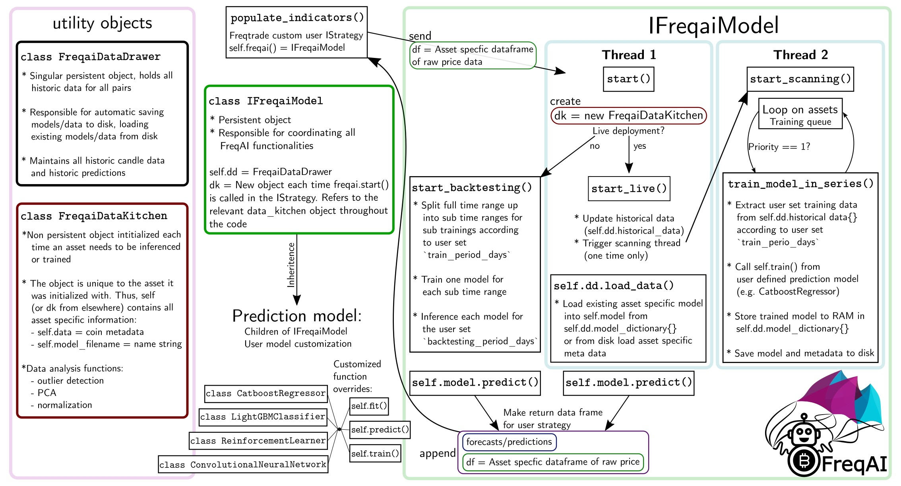

# Development

## Project architecture

The architecture and functions of FreqAI are generalized to encourages development of unique features, functions, models, etc.

The class structure and a detailed algorithmic overview is depicted in the following diagram:



As shown, there are three distinct objects comprising FreqAI:

* **IFreqaiModel** - A singular persistent object containing all the necessary logic to collect, store, and process data, engineer features, run training, and inference models.
* **FreqaiDataKitchen** - A non-persistent object which is created uniquely for each unique asset/model. Beyond metadata, it also contains a variety of data processing tools.
* **FreqaiDataDrawer** - A singular persistent object containing all the historical predictions, models, and save/load methods.

There are a variety of built-in [prediction models](freqai-configuration.md#using-different-prediction-models) which inherit directly from `IFreqaiModel`. Each of these models have full access to all methods in `IFreqaiModel` and can therefore override any of those functions at will. However, advanced users will likely stick to overriding `fit()`, `train()`, `predict()`, and `data_cleaning_train/predict()`.

## Data handling

FreqAI aims to organize model files, prediction data, and meta data in a way that simplifies post-processing and enhances crash resilience by automatic data reloading. The data is saved in a file structure,`user_data_dir/models/`, which contains all the data associated with the trainings and backtests. The `FreqaiDataKitchen()` relies heavily on the file structure for proper training and inferencing and should therefore not be manually modified.

### File structure

The file structure is automatically generated based on the model `identifier` set in the [config](freqai-configuration.md#setting-up-the-configuration-file). The following structure shows where the data is stored for post processing:

| Structure | Description |
|-----------|-------------|
| `config_*.json` | A copy of the model specific configuration file. |
| `historic_predictions.pkl` | A file containing all historic predictions generated during the lifetime of the `identifier` model during live deployment. `historic_predictions.pkl` is used to reload the model after a crash or a config change. A backup file is always held in case of corruption on the main file. FreqAI **automatically** detects corruption and replaces the corrupted file with the backup. |
| `pair_dictionary.json` | A file containing the training queue as well as the on disk location of the most recently trained model. |
| `sub-train-*_TIMESTAMP` | A folder containing all the files associated with a single model, such as: <br>
|| `*_metadata.json` - Metadata for the model, such as normalization max/min, expected training feature list, etc. <br>
|| `*_model.*` - The model file saved to disk for reloading from a crash. Can be `joblib` (typical boosting libs), `zip` (stable_baselines), `hd5` (keras type), etc. <br>
|| `*_pca_object.pkl` - The [Principal component analysis (PCA)](freqai-feature-engineering.md#data-dimensionality-reduction-with-principal-component-analysis) transform (if `principal_component_analysis: True` is set in the config) which will be used to transform unseen prediction features. <br>
|| `*_svm_model.pkl` - The [Support Vector Machine (SVM)](freqai-feature-engineering.md#identifying-outliers-using-a-support-vector-machine-svm) model (if `use_SVM_to_remove_outliers: True` is set in the config) which is used to detect outliers in unseen prediction features. <br>
|| `*_trained_df.pkl` - The dataframe containing all the training features used to train the `identifier` model. This is used for computing the [Dissimilarity Index (DI)](freqai-feature-engineering.md#identifying-outliers-with-the-dissimilarity-index-di) and can also be used for post-processing. <br>
|| `*_trained_dates.df.pkl` - The dates associated with the `trained_df.pkl`, which is useful for post-processing. |

The example file structure would look like this:

```
├── models
│   └── unique-id
│       ├── config_freqai.example.json
│       ├── historic_predictions.backup.pkl
│       ├── historic_predictions.pkl
│       ├── pair_dictionary.json
│       ├── sub-train-1INCH_1662821319
│       │   ├── cb_1inch_1662821319_metadata.json
│       │   ├── cb_1inch_1662821319_model.joblib
│       │   ├── cb_1inch_1662821319_pca_object.pkl
│       │   ├── cb_1inch_1662821319_svm_model.joblib
│       │   ├── cb_1inch_1662821319_trained_dates_df.pkl
│       │   └── cb_1inch_1662821319_trained_df.pkl
│       ├── sub-train-1INCH_1662821371
│       │   ├── cb_1inch_1662821371_metadata.json
│       │   ├── cb_1inch_1662821371_model.joblib
│       │   ├── cb_1inch_1662821371_pca_object.pkl
│       │   ├── cb_1inch_1662821371_svm_model.joblib
│       │   ├── cb_1inch_1662821371_trained_dates_df.pkl
│       │   └── cb_1inch_1662821371_trained_df.pkl
│       ├── sub-train-ADA_1662821344
│       │   ├── cb_ada_1662821344_metadata.json
│       │   ├── cb_ada_1662821344_model.joblib
│       │   ├── cb_ada_1662821344_pca_object.pkl
│       │   ├── cb_ada_1662821344_svm_model.joblib
│       │   ├── cb_ada_1662821344_trained_dates_df.pkl
│       │   └── cb_ada_1662821344_trained_df.pkl
│       └── sub-train-ADA_1662821399
│           ├── cb_ada_1662821399_metadata.json
│           ├── cb_ada_1662821399_model.joblib
│           ├── cb_ada_1662821399_pca_object.pkl
│           ├── cb_ada_1662821399_svm_model.joblib
│           ├── cb_ada_1662821399_trained_dates_df.pkl
│           └── cb_ada_1662821399_trained_df.pkl

```
