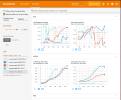

# Reinforcement Learning

!!! Note
    Reinforcement learning dependencies include large packages such as `torch`, which should be explicitly requested during `./setup.sh -i` by answering "y" to the question "Do you also want dependencies for freqai-rl (~700mb additional space required) [y/N]?" Users who prefer docker should ensure they use the docker image appended with `_freqaiRL`. 

Setting up and running a Reinforcement Learning model is the same as running a Regressor or Classifier. The same two flags, `--freqaimodel` and `--strategy`, must be defined on the command line:

```bash
freqtrade trade --freqaimodel ReinforcementLearner --strategy MyRLStrategy --config config.json
```

where `ReinforcementLearner` will use the templated `ReinforcementLearner` from `freqai/prediction_models/ReinforcementLearner`. The strategy, on the other hand, follows the same base [feature engineering](freqai-feature-engineering.md) with `populate_any_indicators` as a typical Regressor:

```python
    def populate_any_indicators(
        self, pair, df, tf, informative=None, set_generalized_indicators=False
    ):

        coin = pair.split('/')[0]

        if informative is None:
            informative = self.dp.get_pair_dataframe(pair, tf)

        # first loop is automatically duplicating indicators for time periods
        for t in self.freqai_info["feature_parameters"]["indicator_periods_candles"]:

            t = int(t)
            informative[f"%-{coin}rsi-period_{t}"] = ta.RSI(informative, timeperiod=t)
            informative[f"%-{coin}mfi-period_{t}"] = ta.MFI(informative, timeperiod=t)
            informative[f"%-{coin}adx-period_{t}"] = ta.ADX(informative, window=t)

        # The following features are necessary for RL models
        informative[f"%-{coin}raw_close"] = informative["close"]
        informative[f"%-{coin}raw_open"] = informative["open"]
        informative[f"%-{coin}raw_high"] = informative["high"]
        informative[f"%-{coin}raw_low"] = informative["low"]

        indicators = [col for col in informative if col.startswith("%")]
        # This loop duplicates and shifts all indicators to add a sense of recency to data
        for n in range(self.freqai_info["feature_parameters"]["include_shifted_candles"] + 1):
            if n == 0:
                continue
            informative_shift = informative[indicators].shift(n)
            informative_shift = informative_shift.add_suffix("_shift-" + str(n))
            informative = pd.concat((informative, informative_shift), axis=1)

        df = merge_informative_pair(df, informative, self.config["timeframe"], tf, ffill=True)
        skip_columns = [
            (s + "_" + tf) for s in ["date", "open", "high", "low", "close", "volume"]
        ]
        df = df.drop(columns=skip_columns)

        # Add generalized indicators here (because in live, it will call this
        # function to populate indicators during training). Notice how we ensure not to
        # add them multiple times
        if set_generalized_indicators:

            # For RL, there are no direct targets to set. This is filler (neutral)
            # until the agent sends an action.
            df["&-action"] = 0

        return df
```

Most of the function remains the same as for typical Regressors, however, the function above shows how the strategy must pass the raw price data to the agent so that it has access to raw OHLCV in the training environent:

```python
        # The following features are necessary for RL models
        informative[f"%-{coin}raw_close"] = informative["close"]
        informative[f"%-{coin}raw_open"] = informative["open"]
        informative[f"%-{coin}raw_high"] = informative["high"]
        informative[f"%-{coin}raw_low"] = informative["low"]
```

Finally, there is no explicit "label" to make - instead the you need to assign the `&-action` column which will contain the agent's actions when accessed in `populate_entry/exit_trends()`. In the present example, the user set the neutral action to 0. This value should align with the environment used. FreqAI provides two environments, both use 0 as the neutral action.

After users realize there are no labels to set, they will soon understand that the agent is making its "own" entry and exit decisions. This makes strategy construction rather simple. The entry and exit signals come from the agent in the form of an integer - which are used directly to decide entries and exits in the strategy:

```python
    def populate_entry_trend(self, df: DataFrame, metadata: dict) -> DataFrame:

        enter_long_conditions = [df["do_predict"] == 1, df["&-action"] == 1]

        if enter_long_conditions:
            df.loc[
                reduce(lambda x, y: x & y, enter_long_conditions), ["enter_long", "enter_tag"]
            ] = (1, "long")

        enter_short_conditions = [df["do_predict"] == 1, df["&-action"] == 3]

        if enter_short_conditions:
            df.loc[
                reduce(lambda x, y: x & y, enter_short_conditions), ["enter_short", "enter_tag"]
            ] = (1, "short")

        return df

    def populate_exit_trend(self, df: DataFrame, metadata: dict) -> DataFrame:
        exit_long_conditions = [df["do_predict"] == 1, df["&-action"] == 2]
        if exit_long_conditions:
            df.loc[reduce(lambda x, y: x & y, exit_long_conditions), "exit_long"] = 1

        exit_short_conditions = [df["do_predict"] == 1, df["&-action"] == 4]
        if exit_short_conditions:
            df.loc[reduce(lambda x, y: x & y, exit_short_conditions), "exit_short"] = 1

        return df
```

It is important to consider that `&-action` depends on which environment they choose to use. The example above shows 5 actions, where 0 is neutral, 1 is enter long, 2 is exit long, 3 is enter short and 4 is exit short. 

## Configuring the Reinforcement Learner

In order to configure the `Reinforcement Learner` the following dictionary to their `freqai` config:

```json
        "rl_config": {
            "train_cycles": 25,
            "max_trade_duration_candles": 300,
            "max_training_drawdown_pct": 0.02,
            "cpu_count": 8,
            "model_type": "PPO",
            "policy_type": "MlpPolicy",
            "model_reward_parameters": {
                "rr": 1,
                "profit_aim": 0.025
            }
        }
```

Parameter details can be found [here](freqai-parameter-table.md), but in general the `train_cycles` decides how many times the agent should cycle through the candle data in its artificial environemtn to train weights in the model. `model_type` is a string which selects one of the available models in [stable_baselines](https://stable-baselines3.readthedocs.io/en/master/)(external link). 

## Creating the reward

As users begin to modify the strategy and the prediction model, they will quickly realize some important differences between the Reinforcement Learner and the Regressors/Classifiers. Firstly, the strategy does not set a target value (no labels!). Instead, the user sets a `calculate_reward()` function inside their custom `ReinforcementLearner.py` file. A default `calculate_reward()` is provided inside `prediction_models/ReinforcementLearner.py` to give users the necessary building blocks to start their own models. It is inside the `calculate_reward()` where users express their creative theories about the market. For example, the user wants to reward their agent when it makes a winning trade, and penalize the agent when it makes a losing trade. Or perhaps, the user wishes to reward the agnet for entering trades, and penalize the agent for sitting in trades too long. Below we show examples of how these rewards are all calculated:

```python
    class MyRLEnv(Base5ActionRLEnv):
        """
        User made custom environment. This class inherits from BaseEnvironment and gym.env.
        Users can override any functions from those parent classes. Here is an example
        of a user customized `calculate_reward()` function.
        """
        def calculate_reward(self, action):
            # first, penalize if the action is not valid
            if not self._is_valid(action):
                return -2
            pnl = self.get_unrealized_profit()

            factor = 100
            # reward agent for entering trades
            if action in (Actions.Long_enter.value, Actions.Short_enter.value) \
                    and self._position == Positions.Neutral:
                return 25
            # discourage agent from not entering trades
            if action == Actions.Neutral.value and self._position == Positions.Neutral:
                return -1
            max_trade_duration = self.rl_config.get('max_trade_duration_candles', 300)
            trade_duration = self._current_tick - self._last_trade_tick
            if trade_duration <= max_trade_duration:
                factor *= 1.5
            elif trade_duration > max_trade_duration:
                factor *= 0.5
            # discourage sitting in position
            if self._position in (Positions.Short, Positions.Long) and \
               action == Actions.Neutral.value:
                return -1 * trade_duration / max_trade_duration
            # close long
            if action == Actions.Long_exit.value and self._position == Positions.Long:
                if pnl > self.profit_aim * self.rr:
                    factor *= self.rl_config['model_reward_parameters'].get('win_reward_factor', 2)
                return float(pnl * factor)
            # close short
            if action == Actions.Short_exit.value and self._position == Positions.Short:
                if pnl > self.profit_aim * self.rr:
                    factor *= self.rl_config['model_reward_parameters'].get('win_reward_factor', 2)
                return float(pnl * factor)
            return 0.
```

### Creating a custom agent

Users can inherit from `stable_baselines3` and customize anything they wish about their agent. Doing this is for advanced users only, an example is presented in `freqai/RL/ReinforcementLearnerCustomAgent.py`

### Using Tensorboard

Reinforcement Learning models benefit from tracking training metrics. FreqAI has integrated Tensorboard to allow users to track training and evaluation performance across all coins and across all retrainings. To start, the user should ensure Tensorboard is installed on their computer:

```bash
pip3 install tensorboard
```

Next, the user can activate Tensorboard with the following command:

```bash
cd freqtrade
tensorboard --logdir user_data/models/unique-id
```

where `unique-id` is the `identifier` set in the `freqai` configuration file. This command must be run in a separate shell if the user wishes to view the output in their browser at 127.0.0.1:6060 (6060 is the default port used by Tensorboard).


