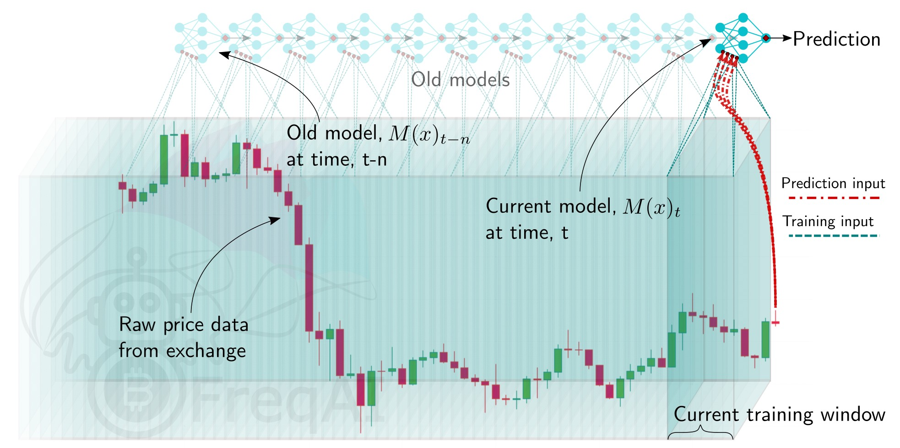

# Running FreqAI

There are two ways to train and deploy an adaptive machine learning model - live deployment and historical backtesting. In both cases, FreqAI runs/simulates periodic retraining of models as shown in the following figure:



## Live deployments

FreqAI can be run dry/live using the following command:

```bash
freqtrade trade --strategy FreqaiExampleStrategy --config config_freqai.example.json --freqaimodel LightGBMRegressor
```

When launched, FreqAI will start training a new model, with a new `identifier`, based on the config settings. Following training, the model will be used to make predictions on incoming candles until a new model is available. New models are typically generated as often as possible, with FreqAI managing an internal queue of the coin pairs to try to keep all models equally up to date. FreqAI will always use the most recently trained model to make predictions on incoming live data. If you do not want FreqAI to retrain new models as often as possible, you can set `live_retrain_hours` to tell FreqAI to wait at least that number of hours before training a new model. Additionally, you can set `expired_hours` to tell FreqAI to avoid making predictions on models that are older than that number of hours.

Trained models are by default saved to disk to allow for reuse during backtesting or after a crash. You can opt to [purge old models](#purging-old-model-data) to save disk space by setting `"purge_old_models": true` in the config.

To start a dry/live run from a saved backtest model (or from a previously crashed dry/live session), you only need to specify the `identifier` of the specific model:

```json
    "freqai": {
        "identifier": "example",
        "live_retrain_hours": 0.5
    }
```

In this case, although FreqAI will initiate with a pre-trained model, it will still check to see how much time has elapsed since the model was trained. If a full `live_retrain_hours` has elapsed since the end of the loaded model, FreqAI will start training a new model.

### Automatic data download

FreqAI automatically downloads the proper amount of data needed to ensure training of a model through the defined `train_period_days` and `startup_candle_count` (see the [parameter table](freqai-parameter-table.md) for detailed descriptions of these parameters). 

### Saving prediction data

All predictions made during the lifetime of a specific `identifier` model are stored in `historic_predictions.pkl` to allow for reloading after a crash or changes made to the config.

### Purging old model data

FreqAI stores new model files after each successful training. These files become obsolete as new models are generated to adapt to new market conditions. If you are planning to leave FreqAI running for extended periods of time with high frequency retraining, you should enable `purge_old_models` in the config:

```json
    "freqai": {
        "purge_old_models": 4,
    }
```

This will automatically purge all models older than the four most recently trained ones to save disk space. Inputing "0" will never purge any models.

## Backtesting

The FreqAI backtesting module can be executed with the following command:

```bash
freqtrade backtesting --strategy FreqaiExampleStrategy --strategy-path freqtrade/templates --config config_examples/config_freqai.example.json --freqaimodel LightGBMRegressor --timerange 20210501-20210701
```

If this command has never been executed with the existing config file, FreqAI will train a new model
for each pair, for each backtesting window within the expanded `--timerange`.

Backtesting mode requires [downloading the necessary data](#downloading-data-to-cover-the-full-backtest-period) before deployment (unlike in dry/live mode where FreqAI handles the data downloading automatically). You should be careful to consider that the time range of the downloaded data is more than the backtesting time range. This is because FreqAI needs data prior to the desired backtesting time range in order to train a model to be ready to make predictions on the first candle of the set backtesting time range. More details on how to calculate the data to download can be found [here](#deciding-the-size-of-the-sliding-training-window-and-backtesting-duration).

!!! Note "Model reuse"
    Once the training is completed, you can execute the backtesting again with the same config file and
    FreqAI will find the trained models and load them instead of spending time training. This is useful
    if you want to tweak (or even hyperopt) buy and sell criteria inside the strategy. If you
    *want* to retrain a new model with the same config file, you should simply change the `identifier`.
    This way, you can return to using any model you wish by simply specifying the `identifier`.

!!! Note
    Backtesting calls `set_freqai_targets()` one time for each backtest window (where the number of windows is the full backtest timerange divided by the `backtest_period_days` parameter). Doing this means that the targets simulate dry/live behavior without look ahead bias. However, the definition of the features in `feature_engineering_*()` is performed once on the entire training timerange. This means that you should be sure that features do not look-ahead into the future.
    More details about look-ahead bias can be found in [Common Mistakes](strategy-customization.md#common-mistakes-when-developing-strategies).

---

### Saving prediction data

To allow for tweaking your strategy (**not** the features!), FreqAI will automatically save the predictions during backtesting so that they can be reused for future backtests and live runs using the same `identifier` model. This provides a performance enhancement geared towards enabling **high-level hyperopting** of entry/exit criteria.

An additional directory called `backtesting_predictions`, which contains all the predictions stored in `hdf` format, will be created in the `unique-id` folder.

To change your **features**, you **must** set a new `identifier` in the config to signal to FreqAI to train new models.

To save the models generated during a particular backtest so that you can start a live deployment from one of them instead of training a new model, you must set `save_backtest_models` to `True` in the config.

### Backtest live collected predictions

FreqAI allow you to reuse live historic predictions through the backtest parameter `--freqai-backtest-live-models`. This can be useful when you want to reuse predictions generated in dry/run for comparison or other study.

The `--timerange` parameter must not be informed, as it will be automatically calculated through the data in the historic predictions file.


### Downloading data to cover the full backtest period

For live/dry deployments, FreqAI will download the necessary data automatically. However, to use backtesting functionality, you need to download the necessary data using `download-data` (details [here](data-download.md#data-downloading)). You need to pay careful attention to understanding how much *additional* data needs to be downloaded to ensure that there is a sufficient amount of training data *before* the start of the backtesting time range. The amount of additional data can be roughly estimated by moving the start date of the time range backwards by `train_period_days` and the `startup_candle_count` (see the [parameter table](freqai-parameter-table.md) for detailed descriptions of these parameters) from the beginning of the desired backtesting time range. 

As an example, to backtest the `--timerange 20210501-20210701` using the [example config](freqai-configuration.md#setting-up-the-configuration-file) which sets `train_period_days` to 30, together with `startup_candle_count: 40` on a maximum `include_timeframes` of 1h, the start date for the downloaded data needs to be `20210501` - 30 days - 40 * 1h / 24 hours = 20210330 (31.7 days earlier than the start of the desired training time range).

### Deciding the size of the sliding training window and backtesting duration

The backtesting time range is defined with the typical `--timerange` parameter in the configuration file. The duration of the sliding training window is set by `train_period_days`, whilst `backtest_period_days` is the sliding backtesting window, both in number of days (`backtest_period_days` can be
a float to indicate sub-daily retraining in live/dry mode). In the presented [example config](freqai-configuration.md#setting-up-the-configuration-file) (found in `config_examples/config_freqai.example.json`), the user is asking FreqAI to use a training period of 30 days and backtest on the subsequent 7 days. After the training of the model, FreqAI will backtest the subsequent 7 days. The "sliding window" then moves one week forward (emulating FreqAI retraining once per week in live mode) and the new model uses the previous 30 days (including the 7 days used for backtesting by the previous model) to train. This is repeated until the end of `--timerange`.  This means that if you set `--timerange 20210501-20210701`, FreqAI will have trained 8 separate models at the end of `--timerange` (because the full range comprises 8 weeks).

!!! Note
    Although fractional `backtest_period_days` is allowed, you should be aware that the `--timerange` is divided by this value to determine the number of models that FreqAI will need to train in order to backtest the full range. For example, by setting a `--timerange` of 10 days, and a `backtest_period_days` of 0.1, FreqAI will need to train 100 models per pair to complete the full backtest. Because of this, a true backtest of FreqAI adaptive training would take a *very* long time. The best way to fully test a model is to run it dry and let it train constantly. In this case, backtesting would take the exact same amount of time as a dry run.

## Defining model expirations

During dry/live mode, FreqAI trains each coin pair sequentially (on separate threads/GPU from the main Freqtrade bot). This means that there is always an age discrepancy between models. If you are training on 50 pairs, and each pair requires 5 minutes to train, the oldest model will be over 4 hours old. This may be undesirable if the characteristic time scale (the trade duration target) for a strategy is less than 4 hours. You can decide to only make trade entries if the model is less than a certain number of hours old by setting the `expiration_hours` in the config file:

```json
    "freqai": {
        "expiration_hours": 0.5,
    }
```

In the presented example config, the user will only allow predictions on models that are less than 1/2 hours old.

## Controlling the model learning process

Model training parameters are unique to the selected machine learning library. FreqAI allows you to set any parameter for any library using the `model_training_parameters` dictionary in the config. The example config (found in `config_examples/config_freqai.example.json`) shows some of the example parameters associated with `Catboost` and `LightGBM`, but you can add any parameters available in those libraries or any other machine learning library you choose to implement.

Data split parameters are defined in `data_split_parameters` which can be any parameters associated with scikit-learn's `train_test_split()` function. `train_test_split()` has a parameters called `shuffle` which allows to shuffle the data or keep it unshuffled. This is particularly useful to avoid biasing training with temporally auto-correlated data. More details about these parameters can be found the [scikit-learn website](https://scikit-learn.org/stable/modules/generated/sklearn.model_selection.train_test_split.html) (external website).

The FreqAI specific parameter `label_period_candles` defines the offset (number of candles into the future) used for the `labels`. In the presented [example config](freqai-configuration.md#setting-up-the-configuration-file), the user is asking for `labels` that are 24 candles in the future.

## Continual learning

You can choose to adopt a continual learning scheme by setting `"continual_learning": true` in the config. By enabling `continual_learning`, after training an initial model from scratch, subsequent trainings will start from the final model state of the preceding training. This gives the new model a "memory" of the previous state. By default, this is set to `False` which means that all new models are trained from scratch, without input from previous models.

???+ danger "Continual learning enforces a constant parameter space"
    Since `continual_learning` means that the model parameter space *cannot* change between trainings, `principal_component_analysis` is automatically disabled when `continual_learning` is enabled. Hint: PCA changes the parameter space and the number of features, learn more about PCA [here](freqai-feature-engineering.md#data-dimensionality-reduction-with-principal-component-analysis).

???+ danger "Experimental functionality"
    Beware that this is currently a naive approach to incremental learning, and it has a high probability of overfitting/getting stuck in local minima while the market moves away from your model. We have the mechanics available in FreqAI primarily for experimental purposes and so that it is ready for more mature approaches to continual learning in chaotic systems like the crypto market.

## Hyperopt

You can hyperopt using the same command as for [typical Freqtrade hyperopt](hyperopt.md):

```bash
freqtrade hyperopt --hyperopt-loss SharpeHyperOptLoss --strategy FreqaiExampleStrategy --freqaimodel LightGBMRegressor --strategy-path freqtrade/templates --config config_examples/config_freqai.example.json --timerange 20220428-20220507
```

`hyperopt` requires you to have the data pre-downloaded in the same fashion as if you were doing [backtesting](#backtesting). In addition, you must consider some restrictions when trying to hyperopt FreqAI strategies:

- The `--analyze-per-epoch` hyperopt parameter is not compatible with FreqAI.
- It's not possible to hyperopt indicators in the `feature_engineering_*()` and `set_freqai_targets()` functions. This means that you cannot optimize model parameters using hyperopt. Apart from this exception, it is possible to optimize all other [spaces](hyperopt.md#running-hyperopt-with-smaller-search-space).
- The backtesting instructions also apply to hyperopt.

The best method for combining hyperopt and FreqAI is to focus on hyperopting entry/exit thresholds/criteria. You need to focus on hyperopting parameters that are not used in your features. For example, you should not try to hyperopt rolling window lengths in the feature creation, or any part of the FreqAI config which changes predictions. In order to efficiently hyperopt the FreqAI strategy, FreqAI stores predictions as dataframes and reuses them. Hence the requirement to hyperopt entry/exit thresholds/criteria only.

A good example of a hyperoptable parameter in FreqAI is a threshold for the [Dissimilarity Index (DI)](freqai-feature-engineering.md#identifying-outliers-with-the-dissimilarity-index-di) `DI_values` beyond which we consider data points as outliers:

```python
di_max = IntParameter(low=1, high=20, default=10, space='buy', optimize=True, load=True)
dataframe['outlier'] = np.where(dataframe['DI_values'] > self.di_max.value/10, 1, 0)
```

This specific hyperopt would help you understand the appropriate `DI_values` for your particular parameter space.

## Using Tensorboard

!!! note "Availability"
    FreqAI includes tensorboard for a variety of models, including XGBoost, all PyTorch models, Reinforcement Learning, and Catboost. If you would like to see Tensorboard integrated into another model type, please open an issue on the [Freqtrade GitHub](https://github.com/freqtrade/freqtrade/issues)

!!! danger "Requirements"
    Tensorboard logging requires the FreqAI torch installation/docker image.


The easiest way to use tensorboard is to ensure `freqai.activate_tensorboard` is set to `True` (default setting) in your configuration file, run FreqAI, then open a separate shell and run:

```bash
cd freqtrade
tensorboard --logdir user_data/models/unique-id
```

where `unique-id` is the `identifier` set in the `freqai` configuration file. This command must be run in a separate shell if you wish to view the output in your browser at 127.0.0.1:6060 (6060 is the default port used by Tensorboard).


!!! note "Deactivate for improved performance"
    Tensorboard logging can slow down training and should be deactivated for production use.
