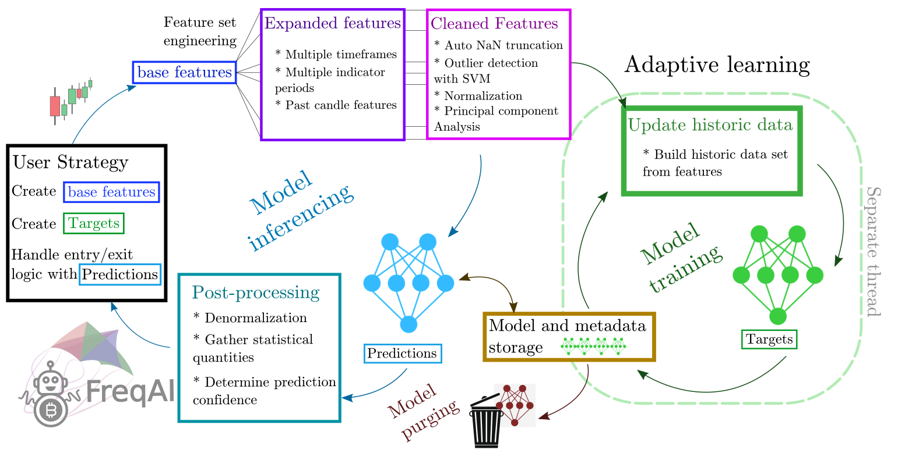
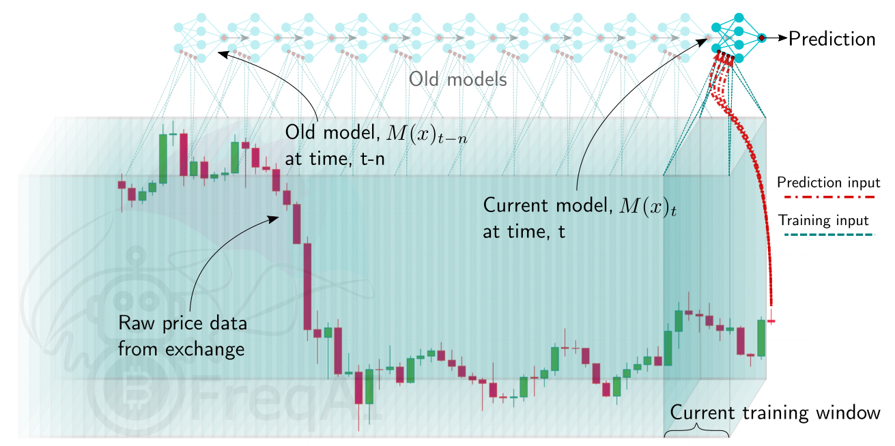
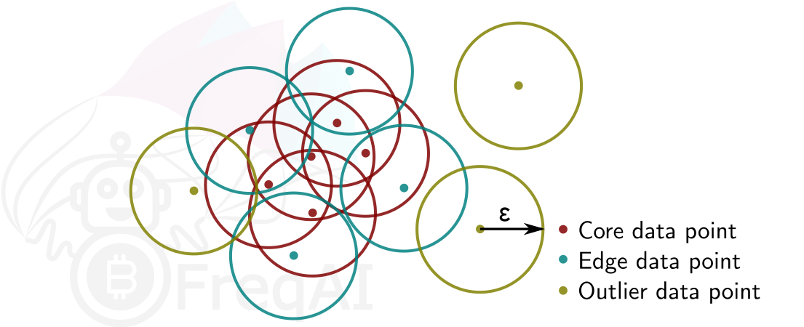

# FreqAI

FreqAI is a module designed to automate a variety of tasks associated with training a predictive machine learning model to generate market forecasts given a set of input features.

Features include:

* **Self-adaptive retraining**: retrain models during [live deployments](#running-the-model-live) to self-adapt to the market in an unsupervised manner.
* **Rapid feature engineering**: create large rich [feature sets](#feature-engineering) (10k+ features) based on simple user-created strategies.
* **High performance**: adaptive retraining occurs on a separate thread (or on GPU if available) from inferencing and bot trade operations. Newest models and data are kept in memory for rapid inferencing.
* **Realistic backtesting**: emulate self-adaptive retraining with a [backtesting module](#backtesting) that automates past retraining.
* **Modifiability**: use the generalized and robust architecture for incorporating any [machine learning library/method](#building-a-custom-prediction-model) available in Python. Eight examples are currently available, including classifiers, regressors, and a convolutional neural network.
* **Smart outlier removal**: remove outliers from training and prediction data sets using a variety of [outlier detection techniques](#outlier-removal).
* **Crash resilience**: store model to disk to make reloading from a crash fast and easy, and [purge obsolete files](#purging-old-model-data) for sustained dry/live runs.
* **Automatic data normalization**: [normalize the data](#feature-normalization) in a smart and statistically safe way.
* **Automatic data download**: compute the data download timerange and update historic data (in live deployments).
* **Cleaning of incoming data**: handle NaNs safely before training and prediction.
* **Dimensionality reduction**: reduce the size of the training data via [Principal Component Analysis](#reducing-data-dimensionality-with-principal-component-analysis).
* **Deploying bot fleets**: set one bot to train models while a fleet of [follower bots](#setting-up-a-follower) inference the models and handle trades.

## Quick start

The easiest way to quickly test FreqAI is to run it in dry mode with the following command

```bash
freqtrade trade --config config_examples/config_freqai.example.json --strategy FreqaiExampleStrategy --freqaimodel LightGBMRegressor --strategy-path freqtrade/templates
```

The user will see the boot-up process of automatic data downloading, followed by simultaneous training and trading.

The example strategy, example prediction model, and example config can be found in
`freqtrade/templates/FreqaiExampleStrategy.py`, `freqtrade/freqai/prediction_models/LightGBMRegressor.py`, and
`config_examples/config_freqai.example.json`, respectively.

## General approach

The user provides FreqAI with a set of custom *base* indicators (the same way as in a typical Freqtrade strategy) as well as target values (*labels*).
FreqAI trains a model to predict the target values based on the input of custom indicators, for each pair in the whitelist. These models are consistently retrained to adapt to market conditions. FreqAI offers the ability to both backtest strategies (emulating reality with periodic retraining) and deploy dry/live runs. In dry/live conditions, FreqAI can be set to constant retraining in a background thread in an effort to keep models as up to date as possible.

An overview of the algorithm is shown below, explaining the data processing pipeline and the model usage. 



### Important machine learning vocabulary

**Features** - the quantities with which a model is trained. All features for a single candle is stored as a vector. In FreqAI, the user
builds the feature sets from anything they can construct in the strategy. 

**Labels** - the target values that a model is trained
toward. Each set of features is associated with a single label that is
defined by the user within the strategy. These labels intentionally look into the
future, and are not available to the model during dry/live/backtesting.

**Training** - the process of feeding individual feature sets, composed of historic data, with associated labels into the
model with the goal of matching input feature sets to associated labels. 

**Train data** - a subset of the historic data that is fed to the model during
training. This data directly influences weight connections in the model.

**Test data** - a subset of the historic data that is used to evaluate the performance of the model after training. This data does not influence nodal weights within the model. 

## Install prerequisites

The normal Freqtrade install process will ask the user if they wish to install FreqAI dependencies. The user should reply "yes" to this question if they wish to use FreqAI. If the user did not reply yes, they can manually install these dependencies after the install with:

``` bash
pip install -r requirements-freqai.txt
```

!!! Note
    Catboost will not be installed on arm devices (raspberry, Mac M1, ARM based VPS, ...), since Catboost does not provide wheels for this platform.

### Usage with docker

For docker users, a dedicated tag with freqAI dependencies is available as `:freqai`.
As such - you can replace the image line in your docker-compose file with `image: freqtradeorg/freqtrade:develop_freqai`.
This image contains the regular freqAI dependencies. Similar to native installs, Catboost will not be available on ARM based devices.

## Setting up FreqAI

### Parameter table

The table below will list all configuration parameters available for FreqAI, presented in the same order as `config_examples/config_freqai.example.json`.

Mandatory parameters are marked as **Required**, which means that they are required to be set in one of the possible ways.

|  Parameter | Description |
|------------|-------------|
|  |  **General configuration parameters**
| `freqai` | **Required.** <br> The parent dictionary containing all the parameters for controlling FreqAI. <br> **Datatype:** Dictionary.
| `startup_candles` | Number of candles needed for *backtesting only* to ensure all indicators are non NaNs at the start of the first train period. <br> **Datatype:** Positive integer.
| `purge_old_models` | Delete obsolete models (otherwise, all historic models will remain on disk). <br> **Datatype:** Boolean. Default: `False`.
| `train_period_days` | **Required.** <br> Number of days to use for the training data (width of the sliding window). <br> **Datatype:** Positive integer.
| `backtest_period_days` | **Required.** <br> Number of days to inference from the trained model before sliding the window defined above, and retraining the model. This can be fractional days, but beware that the user-provided `timerange` will be divided by this number to yield the number of trainings necessary to complete the backtest. <br> **Datatype:** Float.
| `identifier` | **Required.** <br> A unique name for the current model. This can be reused to reload pre-trained models/data. <br> **Datatype:** String.
| `live_retrain_hours` | Frequency of retraining during dry/live runs. <br> Default set to 0, which means the model will retrain as often as possible. <br> **Datatype:** Float > 0.
| `expiration_hours` | Avoid making predictions if a model is more than `expiration_hours` old. <br> Defaults set to 0, which means models never expire. <br> **Datatype:** Positive integer.
| `fit_live_predictions_candles` | Number of historical candles to use for computing target (label) statistics from prediction data, instead of from the training data set. <br> **Datatype:** Positive integer.
| `follow_mode` | If true, this instance of FreqAI will look for models associated with `identifier` and load those for inferencing. A `follower` will **not** train new models. <br> **Datatype:** Boolean. Default: `False`.
|  |  **Feature parameters**
| `feature_parameters` | A dictionary containing the parameters used to engineer the feature set. Details and examples are shown [here](#feature-engineering). <br> **Datatype:** Dictionary.
| `include_timeframes` | A list of timeframes that all indicators in `populate_any_indicators` will be created for. The list is added as features to the base asset feature set. <br> **Datatype:** List of timeframes (strings).
| `include_corr_pairlist` | A list of correlated coins that FreqAI will add as additional features to all `pair_whitelist` coins. All indicators set in `populate_any_indicators` during feature engineering (see details [here](#feature-engineering)) will be created for each coin in this list, and that set of features is added to the base asset feature set. <br> **Datatype:** List of assets (strings).
| `label_period_candles` | Number of candles into the future that the labels are created for. This is used in `populate_any_indicators` (see `templates/FreqaiExampleStrategy.py` for detailed usage). The user can create custom labels, making use of this parameter or not. <br> **Datatype:** Positive integer.
| `include_shifted_candles` | Add features from previous candles to subsequent candles to add historical information. FreqAI takes all features from the `include_shifted_candles` previous candles, duplicates and shifts them so that the information is available for the subsequent candle. <br> **Datatype:** Positive integer.
| `weight_factor` | Used to set weights for training data points according to their recency. See details about how it works [here](#controlling-the-model-learning-process). <br> **Datatype:** Positive float (typically < 1). 
| `indicator_max_period_candles` | The maximum period used in `populate_any_indicators()` for indicator creation. FreqAI uses this information in combination with the maximum timeframe to calculate how many data points that should be downloaded so that the first data point does not have a NaN. <br> **Datatype:** Positive integer.
| `indicator_periods_candles` | Calculate indicators for `indicator_periods_candles` time periods and add them to the feature set. <br> **Datatype:** List of positive integers.
| `stratify_training_data` | This value is used to indicate the grouping of the data. For example, 2 would set every 2nd data point into a separate dataset to be pulled from during training/testing. See details about how it works [here](#stratifying-the-data-for-training-and-testing-the-model) <br> **Datatype:** Positive integer.
| `principal_component_analysis` | Automatically reduce the dimensionality of the data set using Principal Component Analysis. See details about how it works [here](#reducing-data-dimensionality-with-principal-component-analysis) <br> **Datatype:** Boolean. 
| `DI_threshold` | Activates the Dissimilarity Index for outlier detection when > 0. See details about how it works [here](#removing-outliers-with-the-dissimilarity-index). <br> **Datatype:** Positive float (typically < 1).
| `use_SVM_to_remove_outliers` | Train a support vector machine to detect and remove outliers from the training data set, as well as from incoming data points. See details about how it works [here](#removing-outliers-using-a-support-vector-machine-svm). <br> **Datatype:** Boolean.
| `svm_params` | All parameters available in Sklearn's `SGDOneClassSVM()`. See details about some select parameters [here](#removing-outliers-using-a-support-vector-machine-svm). <br> **Datatype:** Dictionary.
| `use_DBSCAN_to_remove_outliers` | Cluster data using DBSCAN to identify and remove outliers from training and prediction data. See details about how it works [here](#removing-outliers-with-dbscan). <br> **Datatype:** Boolean. 
|  |  **Data split parameters**
| `data_split_parameters` | Include any additional parameters available from Scikit-learn `test_train_split()`, which are shown [here](https://scikit-learn.org/stable/modules/generated/sklearn.model_selection.train_test_split.html) (external website). <br> **Datatype:** Dictionary.
| `test_size` | Fraction of data that should be used for testing instead of training. <br> **Datatype:** Positive float < 1.
| `shuffle` | Shuffle the training data points during training. Typically, for time-series forecasting, this is set to `False`. <br> 
|  |  **Model training parameters**
| `model_training_parameters` | A flexible dictionary that includes all parameters available by the user selected model library. For example, if the user uses `LightGBMRegressor`, this dictionary can contain any parameter available by the `LightGBMRegressor` [here](https://lightgbm.readthedocs.io/en/latest/pythonapi/lightgbm.LGBMRegressor.html) (external website). If the user selects a different model, this dictionary can contain any parameter from that model.  <br> **Datatype:** Dictionary.**Datatype:** Boolean.
| `n_estimators` | The number of boosted trees to fit in regression. <br> **Datatype:** Integer.
| `learning_rate` | Boosting learning rate during regression. <br> **Datatype:** Float.
| `n_jobs`, `thread_count`, `task_type` | Set the number of threads for parallel processing and the `task_type` (`gpu` or `cpu`). Different model libraries use different parameter names. <br> **Datatype:** Float.
|  |  **Extraneous parameters**
| `keras` | If your model makes use of Keras (typical for Tensorflow-based prediction models), activate this flag so that the model save/loading follows Keras standards. <br> **Datatype:** Boolean. Default: `False`.
| `conv_width` | The width of a convolutional neural network input tensor. This replaces the need for shifting candles (`include_shifted_candles`) by feeding in historical data points as the second dimension of the tensor. Technically, this parameter can also be used for regressors, but it only adds computational overhead and does not change the model training/prediction. <br> **Datatype:** Integer. Default: 2.

### Important dataframe key patterns

Below are the values the user can expect to include/use inside a typical strategy dataframe (`df[]`):

|  DataFrame Key | Description |
|------------|-------------|
| `df['&*']` | Any dataframe column prepended with `&` in `populate_any_indicators()` is treated as a training target (label) inside FreqAI (typically following the naming convention `&-s*`). The names of these dataframe columns are fed back to the user as the predictions. For example, if the user wishes to predict the price change in the next 40 candles (similar to `templates/FreqaiExampleStrategy.py`), they set `df['&-s_close']`. FreqAI makes the predictions and gives them back under the same key (`df['&-s_close']`) to be used in `populate_entry/exit_trend()`. <br> **Datatype:** Depends on the output of the model.
| `df['&*_std/mean']` | Standard deviation and mean values of the user-defined labels during training (or live tracking with `fit_live_predictions_candles`). Commonly used to understand the rarity of a prediction (use the z-score as shown in `templates/FreqaiExampleStrategy.py` to evaluate how often a particular prediction was observed during training or historically with `fit_live_predictions_candles`). <br> **Datatype:** Float.
| `df['do_predict']` | Indication of an outlier data point. The return value is integer between -1 and 2, which lets the user know if the prediction is trustworthy or not. `do_predict==1` means the prediction is trustworthy. If the Dissimilarity Index (DI, see details [here](#removing-outliers-with-the-dissimilarity-index)) of the input data point is above the user-defined threshold, FreqAI will subtract 1 from `do_predict`, resulting in `do_predict==0`. If `use_SVM_to_remove_outliers()` is active, the Support Vector Machine (SVM) may also detect outliers in training and prediction data. In this case, the SVM will also subtract 1 from `do_predict`. If the input data point was considered an outlier by the SVM but not by the DI, the result will be `do_predict==0`. If both the DI and the SVM considers the input data point to be an outlier, the result will be `do_predict==-1`. A particular case is when `do_predict == 2`, which means that the model has expired due to exceeding `expired_hours`. <br> **Datatype:** Integer between -1 and 2.
| `df['DI_values']` | Dissimilarity Index values are proxies to the level of confidence FreqAI has in the prediction. A lower DI means the prediction is close to the training data, i.e., higher prediction confidence. <br> **Datatype:** Float.
| `df['%*']` | Any dataframe column prepended with `%` in `populate_any_indicators()` is treated as a training feature. For example, the user can include the RSI in the training feature set (similar to in `templates/FreqaiExampleStrategy.py`) by setting `df['%-rsi']`. See more details on how this is done [here](#feature-engineering). <br> **Note**: Since the number of features prepended with `%` can multiply very quickly (10s of thousands of features is easily engineered using the multiplictative functionality described in the `feature_parameters` table shown above), these features are removed from the dataframe upon return from FreqAI. If the user wishes to keep a particular type of feature for plotting purposes, they can prepend it with `%%`. <br> **Datatype:** Depends on the output of the model.

### File structure

`user_data_dir/models/` contains all the data associated with the trainings and backtests.
This file structure is heavily controlled and inferenced by the `FreqaiDataKitchen()`
and should therefore not be modified.

### Example config file

The user interface is isolated to the typical Freqtrade config file. A FreqAI config should include:

```json
    "freqai": {
        "enabled": true,
        "startup_candles": 10000,
        "purge_old_models": true,
        "train_period_days": 30,
        "backtest_period_days": 7,
        "identifier" : "unique-id",
        "feature_parameters" : {
            "include_timeframes": ["5m","15m","4h"],
            "include_corr_pairlist": [
                "ETH/USD",
                "LINK/USD",
                "BNB/USD"
            ],
            "label_period_candles": 24,
            "include_shifted_candles": 2,
            "indicator_max_period_candles": 20,
            "indicator_periods_candles": [10, 20]
        },
        "data_split_parameters" : {
            "test_size": 0.25
        },
        "model_training_parameters" : {
            "n_estimators": 100
        },
    }
```

## Building a FreqAI strategy

The FreqAI strategy requires the user to include the following lines of code in the standard Freqtrade strategy:

```python

    def informative_pairs(self):
        whitelist_pairs = self.dp.current_whitelist()
        corr_pairs = self.config["freqai"]["feature_parameters"]["include_corr_pairlist"]
        informative_pairs = []
        for tf in self.config["freqai"]["feature_parameters"]["include_timeframes"]:
            for pair in whitelist_pairs:
                informative_pairs.append((pair, tf))
            for pair in corr_pairs:
                if pair in whitelist_pairs:
                    continue  # avoid duplication
                informative_pairs.append((pair, tf))
        return informative_pairs

    def populate_indicators(self, dataframe: DataFrame, metadata: dict) -> DataFrame:

        # the model will return all labels created by user in `populate_any_indicators` 
        # (& appended targets), an indication of whether or not the prediction should be accepted, 
        # the target mean/std values for each of the labels created by user in 
        # `populate_any_indicators()` for each training period.

        dataframe = self.freqai.start(dataframe, metadata, self)

        return dataframe

    def populate_any_indicators(
        self, pair, df, tf, informative=None, set_generalized_indicators=False
    ):
        """
        Function designed to automatically generate, name and merge features
        from user indicated timeframes in the configuration file. User controls the indicators
        passed to the training/prediction by prepending indicators with `'%-' + coin `
        (see convention below). I.e. user should not prepend any supporting metrics
        (e.g. bb_lowerband below) with % unless they explicitly want to pass that metric to the
        model.
        :param pair: pair to be used as informative
        :param df: strategy dataframe which will receive merges from informatives
        :param tf: timeframe of the dataframe which will modify the feature names
        :param informative: the dataframe associated with the informative pair
        :param coin: the name of the coin which will modify the feature names.
        """

        coin = pair.split('/')[0]

        if informative is None:
            informative = self.dp.get_pair_dataframe(pair, tf)

        # first loop is automatically duplicating indicators for time periods
        for t in self.freqai_info["feature_parameters"]["indicator_periods_candles"]:
            t = int(t)
            informative[f"%-{coin}rsi-period_{t}"] = ta.RSI(informative, timeperiod=t)
            informative[f"%-{coin}mfi-period_{t}"] = ta.MFI(informative, timeperiod=t)
            informative[f"%-{coin}adx-period_{t}"] = ta.ADX(informative, window=t)

        indicators = [col for col in informative if col.startswith("%")]
        # This loop duplicates and shifts all indicators to add a sense of recency to data
        for n in range(self.freqai_info["feature_parameters"]["include_shifted_candles"] + 1):
            if n == 0:
                continue
            informative_shift = informative[indicators].shift(n)
            informative_shift = informative_shift.add_suffix("_shift-" + str(n))
            informative = pd.concat((informative, informative_shift), axis=1)

        df = merge_informative_pair(df, informative, self.config["timeframe"], tf, ffill=True)
        skip_columns = [
            (s + "_" + tf) for s in ["date", "open", "high", "low", "close", "volume"]
        ]
        df = df.drop(columns=skip_columns)

        # Add generalized indicators here (because in live, it will call this
        # function to populate indicators during training). Notice how we ensure not to
        # add them multiple times
        if set_generalized_indicators:

            # user adds targets here by prepending them with &- (see convention below)
            # If user wishes to use multiple targets, a multioutput prediction model
            # needs to be used such as templates/CatboostPredictionMultiModel.py
            df["&-s_close"] = (
                df["close"]
                .shift(-self.freqai_info["feature_parameters"]["label_period_candles"])
                .rolling(self.freqai_info["feature_parameters"]["label_period_candles"])
                .mean()
                / df["close"]
                - 1
            )

        return df


```

Notice how the `populate_any_indicators()` is where the user adds their own features ([more information](#feature-engineering)) and labels ([more information](#setting-classifier-targets)). See a full example at `templates/FreqaiExampleStrategy.py`.

## Creating a dynamic target

The `&*_std/mean` return values describe the statistical fit of the user defined label *during the most recent training*. This value allows the user to know the rarity of a given prediction. For example, `templates/FreqaiExampleStrategy.py`, creates a `target_roi` which is based on filtering out predictions that are below a given z-score of 1.25.

```python
dataframe["target_roi"] = dataframe["&-s_close_mean"] + dataframe["&-s_close_std"] * 1.25
dataframe["sell_roi"] = dataframe["&-s_close_mean"] - dataframe["&-s_close_std"] * 1.25
```

If the user wishes to consider the population
of *historical predictions* for creating the dynamic target instead of the trained labels, (as discussed above) the user
can do so by setting `fit_live_prediction_candles` in the config to the number of historical prediction candles
the user wishes to use to generate target statistics.

```json
    "freqai": {
        "fit_live_prediction_candles": 300,
    }
```

If the user sets this value, FreqAI will initially use the predictions from the training data
and subsequently begin introducing real prediction data as it is generated. FreqAI will save
this historical data to be reloaded if the user stops and restarts a model with the same `identifier`.

## Building a custom prediction model

FreqAI has multiple example prediction model libraries, such as `Catboost` regression (`freqai/prediction_models/CatboostRegressor.py`) and `LightGBM` regression.
However, the user can customize and create their own prediction models using the `IFreqaiModel` class.
The user is encouraged to inherit `train()` and `predict()` to let them customize various aspects of their training procedures.

## Feature engineering

Features are added by the user inside the `populate_any_indicators()` method of the strategy
by prepending indicators with `%`, and labels with `&`.  

There are some important components/structures that the user *must* include when building their feature set; the use of these is shown below:

```python
    def populate_any_indicators(
        self, pair, df, tf, informative=None, set_generalized_indicators=False
    ):
        """
        Function designed to automatically generate, name, and merge features
        from user-indicated timeframes in the configuration file. The user controls the indicators
        passed to the training/prediction by prepending indicators with `'%-' + coin `
        (see convention below). I.e., the user should not prepend any supporting metrics
        (e.g., bb_lowerband below) with % unless they explicitly want to pass that metric to the
        model.
        :param pair: pair to be used as informative
        :param df: strategy dataframe which will receive merges from informatives
        :param tf: timeframe of the dataframe which will modify the feature names
        :param informative: the dataframe associated with the informative pair
        :param coin: the name of the coin which will modify the feature names.
        """

        coin = pair.split('/')[0]

        if informative is None:
            informative = self.dp.get_pair_dataframe(pair, tf)

        # first loop is automatically duplicating indicators for time periods
        for t in self.freqai_info["feature_parameters"]["indicator_periods_candles"]:
            t = int(t)
            informative[f"%-{coin}rsi-period_{t}"] = ta.RSI(informative, timeperiod=t)
            informative[f"%-{coin}mfi-period_{t}"] = ta.MFI(informative, timeperiod=t)
            informative[f"%-{coin}adx-period_{t}"] = ta.ADX(informative, window=t)

            bollinger = qtpylib.bollinger_bands(
                qtpylib.typical_price(informative), window=t, stds=2.2
            )
            informative[f"{coin}bb_lowerband-period_{t}"] = bollinger["lower"]
            informative[f"{coin}bb_middleband-period_{t}"] = bollinger["mid"]
            informative[f"{coin}bb_upperband-period_{t}"] = bollinger["upper"]

            informative[f"%-{coin}bb_width-period_{t}"] = (
                informative[f"{coin}bb_upperband-period_{t}"]
                - informative[f"{coin}bb_lowerband-period_{t}"]
            ) / informative[f"{coin}bb_middleband-period_{t}"]
            informative[f"%-{coin}close-bb_lower-period_{t}"] = (
                informative["close"] / informative[f"{coin}bb_lowerband-period_{t}"]
            )

            informative[f"%-{coin}relative_volume-period_{t}"] = (
                informative["volume"] / informative["volume"].rolling(t).mean()
            )

        indicators = [col for col in informative if col.startswith("%")]
        # This loop duplicates and shifts all indicators to add a sense of recency to data
        for n in range(self.freqai_info["feature_parameters"]["include_shifted_candles"] + 1):
            if n == 0:
                continue
            informative_shift = informative[indicators].shift(n)
            informative_shift = informative_shift.add_suffix("_shift-" + str(n))
            informative = pd.concat((informative, informative_shift), axis=1)

        df = merge_informative_pair(df, informative, self.config["timeframe"], tf, ffill=True)
        skip_columns = [
            (s + "_" + tf) for s in ["date", "open", "high", "low", "close", "volume"]
        ]
        df = df.drop(columns=skip_columns)

        # Add generalized indicators here (because in live, it will call this
        # function to populate indicators during training). Notice how we ensure not to
        # add them multiple times
        if set_generalized_indicators:
            df["%-day_of_week"] = (df["date"].dt.dayofweek + 1) / 7
            df["%-hour_of_day"] = (df["date"].dt.hour + 1) / 25

            # user adds targets here by prepending them with &- (see convention below)
            # If user wishes to use multiple targets, a multioutput prediction model
            # needs to be used such as templates/CatboostPredictionMultiModel.py
            df["&-s_close"] = (
                df["close"]
                .shift(-self.freqai_info["feature_parameters"]["label_period_candles"])
                .rolling(self.freqai_info["feature_parameters"]["label_period_candles"])
                .mean()
                / df["close"]
                - 1
            )

        return df
```

In the presented example strategy, the user does not wish to pass the `bb_lowerband` as a feature to the model,
and has therefore not prepended it with `%`. The user does, however, wish to pass `bb_width` to the
model for training/prediction and has therefore prepended it with `%`.

The `include_timeframes` in the example config above are the timeframes (`tf`) of each call to `populate_any_indicators()` in the strategy. In the present case, the user is asking for the
`5m`, `15m`, and `4h` timeframes of the `rsi`, `mfi`, `roc`, and `bb_width` to be included in the feature set.

The user can ask for each of the defined features to be included also from
informative pairs using the `include_corr_pairlist`. This means that the feature
set will include all the features from `populate_any_indicators` on all the `include_timeframes` for each of the correlated pairs defined in the config (`ETH/USD`, `LINK/USD`, and `BNB/USD`).

`include_shifted_candles` indicates the number of previous
candles to include in the feature set. For example, `include_shifted_candles: 2` tells
FreqAI to include the past 2 candles for each of the features in the feature set.

In total, the number of features the user of the presented example strat has created is:
length of `include_timeframes` * no. features in `populate_any_indicators()` * length of `include_corr_pairlist` * no. `include_shifted_candles` * length of `indicator_periods_candles`
 $= 3 * 3 * 3 * 2 * 2 = 108$.

Another structure to consider is the location of the labels at the bottom of the example function (below `if set_generalized_indicators:`). 
This is where the user will add single features and labels to their feature set to avoid duplication of them from
various configuration parameters that multiply the feature set, such as `include_timeframes`.

!!! Note
    Features **must** be defined in `populate_any_indicators()`. Definining FreqAI features in `populate_indicators()`
    will cause the algorithm to fail in live/dry mode. If the user wishes to add generalized features that are not associated with 
    a specific pair or timeframe, they should use the following structure inside `populate_any_indicators()`
    (as exemplified in `freqtrade/templates/FreqaiExampleStrategy.py`):

    ```python
        def populate_any_indicators(self, metadata, pair, df, tf, informative=None, coin="", set_generalized_indicators=False):

            ...

            # Add generalized indicators here (because in live, it will call only this function to populate 
            # indicators for retraining). Notice how we ensure not to add them multiple times by associating
            # these generalized indicators to the basepair/timeframe
            if set_generalized_indicators:
                df['%-day_of_week'] = (df["date"].dt.dayofweek + 1) / 7
                df['%-hour_of_day'] = (df['date'].dt.hour + 1) / 25

                # user adds targets here by prepending them with &- (see convention below)
                # If user wishes to use multiple targets, a multioutput prediction model
                # needs to be used such as templates/CatboostPredictionMultiModel.py
                df["&-s_close"] = (
                    df["close"]
                    .shift(-self.freqai_info["feature_parameters"]["label_period_candles"])
                    .rolling(self.freqai_info["feature_parameters"]["label_period_candles"])
                    .mean()
                    / df["close"]
                    - 1
                    )
    ```

    (Please see the example script located in `freqtrade/templates/FreqaiExampleStrategy.py` for a full example of `populate_any_indicators()`.)

## Setting classifier targets

FreqAI includes the `CatboostClassifier` via the flag `--freqaimodel CatboostClassifier`. The user should take care to set the classes using strings:

```python
df['&s-up_or_down'] = np.where( df["close"].shift(-100) > df["close"], 'up', 'down')
```

Additionally, the example classifier models do not accommodate multiple labels, but they do allow multi-class classification within a single label column.

## Running FreqAI

There are two ways to train and deploy an adaptive machine learning model. FreqAI enables live deployment as well as backtesting analyses. In both cases, a model is trained periodically, as shown in the following figure.



### Running the model live

FreqAI can be run dry/live using the following command:

```bash
freqtrade trade --strategy FreqaiExampleStrategy --config config_freqai.example.json --freqaimodel LightGBMRegressor
```

By default, FreqAI will not find any existing models and will start by training a new one
based on the user's configuration settings. Following training, the model will be used to make predictions on incoming candles until a new model is available. New models are typically generated as often as possible, with FreqAI managing an internal queue of the coin pairs to try to keep all models equally up to date. FreqAI will always use the most recently trained model to make predictions on incoming live data. If the user does not want FreqAI to retrain new models as often as possible, they can set `live_retrain_hours` to tell FreqAI to wait at least that number of hours before training a new model. Additionally, the user can set `expired_hours` to tell FreqAI to avoid making predictions on models that are older than that number of hours.

If the user wishes to start a dry/live run from a saved backtest model (or from a previously crashed dry/live session), the user only needs to reuse
the same `identifier` parameter:

```json
    "freqai": {
        "identifier": "example",
        "live_retrain_hours": 0.5
    }
```

In this case, although FreqAI will initiate with a
pre-trained model, it will still check to see how much time has elapsed since the model was trained,
and if a full `live_retrain_hours` has elapsed since the end of the loaded model, FreqAI will retrain.

### Backtesting

The FreqAI backtesting module can be executed with the following command:

```bash
freqtrade backtesting --strategy FreqaiExampleStrategy --config config_freqai.example.json --freqaimodel LightGBMRegressor --timerange 20210501-20210701
```

Backtesting mode requires the user to have the data pre-downloaded (unlike in dry/live mode where FreqAI automatically downloads the necessary data). The user should be careful to consider that the time range of the downloaded data is more than the backtesting time range. This is because FreqAI needs data prior to the desired backtesting time range in order to train a model to be ready to make predictions on the first candle of the user-set backtesting time range. More details on how to calculate the data to download can be found [here](#deciding-the-sliding-training-window-and-backtesting-duration).

If this command has never been executed with the existing config file, it will train a new model
for each pair, for each backtesting window within the expanded `--timerange`.

!!! Note "Model reuse"
    Once the training is completed, the user can execute the backtesting again with the same config file and
    FreqAI will find the trained models and load them instead of spending time training. This is useful
    if the user wants to tweak (or even hyperopt) buy and sell criteria inside the strategy. If the user
    *wants* to retrain a new model with the same config file, then they should simply change the `identifier`.
    This way, the user can return to using any model they wish by simply specifying the `identifier`.

---

### Deciding the size of the sliding training window and backtesting duration

The user defines the backtesting timerange with the typical `--timerange` parameter in the
configuration file. The duration of the sliding training window is set by `train_period_days`, whilst
`backtest_period_days` is the sliding backtesting window, both in number of days (`backtest_period_days` can be
a float to indicate sub-daily retraining in live/dry mode). In the presented example config,
the user is asking FreqAI to use a training period of 30 days and backtest on the subsequent 7 days.
This means that if the user sets `--timerange 20210501-20210701`,
FreqAI will train have trained 8 separate models at the end of `--timerange` (because the full range comprises 8 weeks). After the training of the model, FreqAI will backtest the subsequent 7 days. The "sliding window" then moves one week forward (emulating FreqAI retraining once per week in live mode) and the new model uses the previous 30 days (including the 7 days used for backtesting by the previous model) to train. This is repeated until the end of `--timerange`.

In live mode, the required training data is automatically computed and downloaded. However, in backtesting mode,
the user must manually enter the required number of `startup_candles` in the config. This value
is used to increase the data to FreqAI, which should be sufficient to enable all indicators
to be NaN free at the beginning of the first training. This is done by identifying the
longest timeframe (`4h` in presented example config) and the longest indicator period (`20` days in presented example config)
and adding this to the `train_period_days`. The units need to be in the base candle time frame:
`startup_candles` = ( 4 hours * 20 max period * 60 minutes/hour + 30 day train_period_days * 1440 minutes per day ) / 5 min (base time frame) = 9360.

!!! Note
    In dry/live mode, this is all precomputed and handled automatically. Thus, `startup_candle` has no influence on dry/live mode.

!!! Note
    Although fractional `backtest_period_days` is allowed, the user should be aware that the `--timerange` is divided by this value to determine the number of models that FreqAI will need to train in order to backtest the full range. For example, if the user wants to set a `--timerange` of 10 days, and asks for a `backtest_period_days` of 0.1, FreqAI will need to train 100 models per pair to complete the full backtest. Because of this, a true backtest of FreqAI adaptive training would take a *very* long time. The best way to fully test a model is to run it dry and let it constantly train. In this case, backtesting would take the exact same amount of time as a dry run.

### Defining model expirations

During dry/live mode, FreqAI trains each coin pair sequentially (on separate threads/GPU from the main Freqtrade bot). This means that there is always an age discrepancy between models. If a user is training on 50 pairs, and each pair requires 5 minutes to train, the oldest model will be over 4 hours old. This may be undesirable if the characteristic time scale (the trade duration target) for a strategy is less than 4 hours. The user can decide to only make trade entries if the model is less than 
a certain number of hours old by setting the `expiration_hours` in the config file:

```json
    "freqai": {
        "expiration_hours": 0.5,
    }
```

In the presented example config, the user will only allow predictions on models that are less than 1/2 hours old.

### Purging old model data

FreqAI stores new model files each time it retrains. These files become obsolete as new models are trained and FreqAI adapts to new market conditions. Users planning to leave FreqAI running for extended periods of time with high frequency retraining should enable `purge_old_models` in their config:

```json
    "freqai": {
        "purge_old_models": true,
    }
```

This will automatically purge all models older than the two most recently trained ones.

### Returning additional info from training

The user may find that there are some important metrics that they'd like to return to the strategy at the end of each model training.
The user can include these metrics by assigning them to `dk.data['extra_returns_per_train']['my_new_value'] = XYZ` inside their custom prediction model class. FreqAI takes the `my_new_value` assigned in this dictionary and expands it to fit the return dataframe to the strategy.
The user can then use the value in the strategy with `dataframe['my_new_value']`. An example of how this is already used in FreqAI is
the `&*_mean` and `&*_std` values, which indicate the mean and standard deviation of the particular target (label) during the most recent training.
An example, where the user wants to use live metrics from the trade database, is shown below:

```json
    "freqai": {
        "extra_returns_per_train": {"total_profit": 4}
    }
```

The user needs to set the standard dictionary in the config so that FreqAI can return proper dataframe shapes.  These values will likely be overridden by the prediction model, but in the case where the model has yet to set them, or needs a default initial value, this is the value that will be returned.

### Setting up a follower

The user can define:

```json
    "freqai": {
        "follow_mode": true,
        "identifier": "example"
    }
```

to indicate to the bot that it should not train models, but instead should look for models trained by a leader with the same `identifier`. In this example, the user has a leader bot with the `identifier: "example"`. The leader bot is already running or launching simultaneously as the follower.
The follower will load models created by the leader and inference them to obtain predictions.

## Data manipulation techniques

### Feature normalization

The feature set created by the user is automatically normalized to the training data. This includes all test data and unseen prediction data (dry/live/backtest).

### Reducing data dimensionality with Principal Component Analysis

Users can reduce the dimensionality of their features by activating the `principal_component_analysis` in the config:

```json
    "freqai": {
        "feature_parameters" : {
            "principal_component_analysis": true
        }
    }
```

This will perform PCA on the features and reduce the dimensionality of the data so that the explained variance of the data set is >= 0.999.

### Stratifying the data for training and testing the model

The user can stratify (group) the training/testing data using:

```json
    "freqai": {
        "feature_parameters" : {
            "stratify_training_data": 3
        }
    }
```

This will split the data chronologically so that every Xth data point is used to test the model after training. In the
example above, the user is asking for every third data point in the dataframe to be used for
testing; the other points are used for training. 

The test data is used to evaluate the performance of the model after training. If the test score is high, the model is able to capture the behavior of the data well. If the test score is low, either the model either does not capture the complexity of the data, the test data is significantly different from the train data, or a different model should be used. 

### Controlling the model learning process

Model training parameters are unique to the machine learning library selected by the user. FreqAI allows the user to set any parameter for any library using the `model_training_parameters` dictionary in the user configuration file. The example configuration file (found in `config_examples/config_freqai.example.json`) show some of the example parameters associated with `Catboost` and `LightGBM`, but the user can add any parameters available in those libraries.

Data split parameters are defined in `data_split_parameters` which can be any parameters associated with `Sklearn`'s `train_test_split()` function. 

FreqAI includes some additional parameters such as `weight_factor`, which allows the user to weight more recent data more strongly
than past data via an exponential function:

$$ W_i = \exp(\frac{-i}{\alpha*n}) $$

where $W_i$ is the weight of data point $i$ in a total set of $n$ data points. Below is a figure showing the effect of different weight factors on the data points (candles) in a feature set.


`train_test_split()` has a parameters called `shuffle` that allows the user to keep the data unshuffled. This is particularly useful to avoid biasing training with temporally auto-correlated data.

Finally, `label_period_candles` defines the offset (number of candles into the future) used for the `labels`. In the presented example config,
the user is asking for `labels` that are 24 candles in the future.

### Outlier removal

#### Removing outliers with the Dissimilarity Index

The user can tell FreqAI to remove outlier data points from the training/test data sets using a Dissimilarity Index by including the following statement in the config:

```json
    "freqai": {
        "feature_parameters" : {
            "DI_threshold": 1
        }
    }
```

Equity and crypto markets suffer from a high level of non-patterned noise in the form of outlier data points. The Dissimilarity Index (DI) aims to quantify the uncertainty associated with each prediction made by the model. The DI allows predictions which are outliers (not existent in the model feature space) to be thrown out due to low levels of certainty. 

To do so, FreqAI measures the distance between each training data point (feature vector), $X_{a}$, and all other training data points:

$$ d_{ab} = \sqrt{\sum_{j=1}^p(X_{a,j}-X_{b,j})^2} $$

where $d_{ab}$ is the distance between the normalized points $a$ and $b$. $p$ is the number of features, i.e., the length of the vector $X$. The characteristic distance, $\overline{d}$ for a set of training data points is simply the mean of the average distances:

$$ \overline{d} = \sum_{a=1}^n(\sum_{b=1}^n(d_{ab}/n)/n) $$

$\overline{d}$ quantifies the spread of the training data, which is compared to the distance between a new prediction feature vectors, $X_k$ and all the training data:

$$ d_k = \arg \min d_{k,i} $$

which enables the estimation of the Dissimilarity Index as:

$$ DI_k = d_k/\overline{d} $$

The user can tweak the DI through the `DI_threshold` to increase or decrease the extrapolation of the trained model. 

Below is a figure that describes the DI for a 3D data set.


#### Removing outliers using a Support Vector Machine (SVM)

The user can tell FreqAI to remove outlier data points from the training/test data sets using a SVM by setting:

```json
    "freqai": {
        "feature_parameters" : {
            "use_SVM_to_remove_outliers": true
        }
    }
```

FreqAI will train an SVM on the training data (or components of it if the user activated
`principal_component_analysis`) and remove any data point that the SVM deems to be beyond the feature space. 

The parameter `shuffle` is by default set to `False` to ensure consistent results. If it is set to `True`, running the SVM multiple times on the same data set might result in different outcomes due to `max_iter` being to low for the algorithm to reach the demanded `tol`. Increasing `max_iter` solves this issue but causes the procedure to take longer time. 

The parameter `nu`, *very* broadly, is the amount of data points that should be considered outliers. 

#### Removing outliers with DBSCAN

The user can configure FreqAI to use DBSCAN to cluster and remove outliers from the training/test data set or incoming outliers from predictions, by activating `use_DBSCAN_to_remove_outliers` in the config:

```json
    "freqai": {
        "feature_parameters" : {
            "use_DBSCAN_to_remove_outliers": true
        }
    }
```

DBSCAN is an unsupervised machine learning algorithm that clusters data without needing to know how many clusters there should be.

Given a number of data points $N$, and a distance $\varepsilon$, DBSCAN clusters the data set by setting all data points that have $N-1$ other data points within a distance of $\varepsilon$ as *core points*. A data point that is within a distance of $\varepsilon$ from a *core point* but that does not have $N-1$ other data points within a distance of $\varepsilon$ from itself is considered an *edge point*. A cluster is then the collection of *core points* and *edge points*. Data points that have no other data points at a distance $<\varepsilon$ are considered outliers. The figure below shows a cluster with $N = 3$.



FreqAI uses `sklearn.cluster.DBSCAN` (details are available on scikit-learn's webpage [here](#https://scikit-learn.org/stable/modules/generated/sklearn.cluster.DBSCAN.html)) with `min_samples` ($N$) taken as double the no. of user-defined features, and `eps` ($\varepsilon$) taken as the longest distance in the *k-distance graph* computed from the nearest neighbors in the pairwise distances of all data points in the feature set.

## Additional information

### Common pitfalls

FreqAI cannot be combined with dynamic `VolumePairlists` (or any pairlist filter that adds and removes pairs dynamically).
This is for performance reasons - FreqAI relies on making quick predictions/retrains. To do this effectively,
it needs to download all the training data at the beginning of a dry/live instance. FreqAI stores and appends
new candles automatically for future retrains. This means that if new pairs arrive later in the dry run due to a volume pairlist, it will not have the data ready. However, FreqAI does work with the `ShufflePairlist` or a `VolumePairlist` which keeps the total pairlist constant (but reorders the pairs according to volume).

## Credits

FreqAI was developed by a group of individuals who all contributed specific skillsets to the project.

Conception and software development:
Robert Caulk @robcaulk

Theoretical brainstorming, data analysis:
Elin Törnquist @th0rntwig

Code review, software architecture brainstorming:
@xmatthias

Beta testing and bug reporting:
@bloodhunter4rc, Salah Lamkadem @ikonx, @ken11o2, @longyu, @paranoidandy, @smidelis, @smarm
Juha Nykänen @suikula, Wagner Costa @wagnercosta
