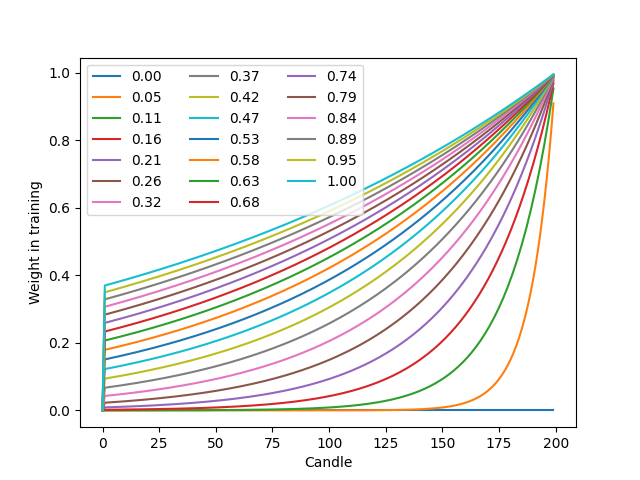

# FreqAI

FreqAI is a module designed to automate a variety of tasks associated with
training a predictive model to provide signals based on input features.

Among the the features included:

* Create large rich feature sets (10k+ features) based on simple user created strategies.
* Sweep model training and backtesting to simulate consistent model retraining through time.
* Remove outliers automatically from training and prediction sets using a Dissimilarity Index and Support Vector Machines.
* Reduce the dimensionality of the data with Principal Component Analysis.
* Store models to disk to make reloading from a crash fast and easy (and purge obsolete files automatically for sustained dry/live runs).
* Normalize the data automatically in a smart and statistically safe way.
* Automated data download and data handling.
* Clean the incoming data of NaNs in a safe way before training and prediction.
* Retrain live automatically so that the model self-adapts to the market in an unsupervised manner.

## General approach

The user provides FreqAI with a set of custom *base* indicators (created inside the strategy the same way
a typical Freqtrade strategy is created) as well as target values which look into the future.
FreqAI trains a model to predict the target value based on the input of custom indicators for each pair in the whitelist. These models are consistently retrained to adapt to market conditions. FreqAI offers the ability to both backtest strategies (emulating reality with periodic retraining) and deploy dry/live. In dry/live conditions, FreqAI can be set to constant retraining in a background thread in an effort to keep models as young as possible. 

An overview of the algorithm is shown here to help users understand the data processing pipeline and the model usage. 


## Background and vocabulary

**Features** are the quantities with which a model is trained. $X_i$ represents the
vector of all features for a single candle. In Freqai, the user
builds the features from anything they can construct in the strategy.

**Labels** are the target values with which the weights inside a model are trained
toward. Each set of features is associated with a single label, which is also
defined within the strategy by the user. These labels intentionally look into the
future, and are not available to the model during dryrun/live/backtesting.

**Training** refers to the process of feeding individual feature sets into the
model with associated labels with the goal of matching input feature sets to associated labels.

**Train data** is a subset of the historic data which is fed to the model during
training to adjust weights. This data directly influences weight connections in the model.

**Test data** is a subset of the historic data which is used to evaluate the
intermediate performance of the model during training. This data does not
directly influence nodal weights within the model.

## Install prerequisites

Use `pip` to install the prerequisites with:

``` bash
pip install -r requirements-freqai.txt
```

!!! Note
    Catboost will not be installed on arm devices (raspberry, Mac M1, ARM based VPS, ...), since Catboost does not provide wheels for this platform.

## Running from the example files

An example strategy, an example prediction model, and example config can all be found in
`freqtrade/templates/FreqaiExampleStrategy.py`, `freqtrade/freqai/prediction_models/LightGBMPredictionModel.py`,
`config_examples/config_freqai.example.json`, respectively.

Assuming the user has downloaded the necessary data, Freqai can be executed from these templates with:

```bash
freqtrade backtesting --config config_examples/config_freqai.example.json --strategy FreqaiExampleStrategy --freqaimodel LightGBMPredictionModel --strategy-path freqtrade/templates --timerange 20220101-20220201
```

## Configuring the bot

### Parameter table

The table below will list all configuration parameters available for `FreqAI`.

Mandatory parameters are marked as **Required**, which means that they are required to be set in one of the possible ways.

|  Parameter | Description |
|------------|-------------|
| `freqai` | **Required.** The dictionary containing all the parameters for controlling FreqAI. <br> **Datatype:** dictionary.
| `identifier` | **Required.** A unique name for the current model. This can be reused to reload pre-trained models/data. <br> **Datatype:** string.
| `train_period_days` | **Required.** Number of days to use for the training data (width of the sliding window). <br> **Datatype:** positive integer.
| `backtest_period_days` | **Required.** Number of days to inference into the trained model before sliding the window and retraining. This can be fractional days, but beware that the user provided `timerange` will be divided by this number to yield the number of trainings necessary to complete the backtest. <br> **Datatype:** Float.
| `live_retrain_hours` | Frequency of retraining during dry/live runs. Default set to 0, which means it will retrain as often as possible. **Datatype:** Float > 0.
| `follow_mode` | If true, this instance of FreqAI will look for models associated with `identifier` and load those for inferencing. A `follower` will **not** train new models. `False` by default. <br> **Datatype:** boolean.
| `startup_candles` | Number of candles needed for *backtesting only* to ensure all indicators are non NaNs at the start of the first train period. <br> **Datatype:** positive integer.
| `fit_live_predictions_candles` | Computes target (label) statistics from prediction data, instead of from the training data set. Number of candles is the number of historical candles it uses to generate the statistics. <br> **Datatype:** positive integer.
| `purge_old_models` | Tell FreqAI to delete obsolete models. Otherwise, all historic models will remain on disk. Defaults to `False`. <br> **Datatype:** boolean.
| `expiration_hours` | Ask FreqAI to avoid making predictions if a model is more than `expiration_hours` old. Defaults to 0 which means models never expire. <br> **Datatype:** positive integer.
|  |  **Feature Parameters**
| `feature_parameters` | A dictionary containing the parameters used to engineer the feature set. Details and examples shown [here](#building-the-feature-set) <br> **Datatype:** dictionary.
| `include_corr_pairlist` | A list of correlated coins that FreqAI will add as additional features to all `pair_whitelist` coins. All indicators set in `populate_any_indicators` will be created for each coin in this list, and that set of features is added to the base asset feature set. <br> **Datatype:** list of assets (strings).
| `include_timeframes` | A list of timeframes that all indicators in `populate_any_indicators` will be created for and added as features to the base asset feature set. <br> **Datatype:** list of timeframes (strings).
| `label_period_candles` | Number of candles into the future that the labels are created for. This is used in `populate_any_indicators`, refer to `templates/FreqaiExampleStrategy.py` for detailed usage. The user can create custom labels, making use of this parameter not. <br> **Datatype:** positive integer.
| `include_shifted_candles` | Parameter used to add a sense of temporal recency to flattened regression type input data. `include_shifted_candles` takes all features, duplicates and shifts them by the number indicated by user. <br> **Datatype:** positive integer.
| `DI_threshold` | Activates the Dissimilarity Index for outlier detection when above 0, explained more [here](#removing-outliers-with-the-dissimilarity-index). <br> **Datatype:** positive float (typically below 1).
| `weight_factor` | Used to set weights for training data points according to their recency, see details and a figure of how it works [here](##controlling-the-model-learning-process). <br> **Datatype:** positive float (typically below 1).
| `principal_component_analysis` | Ask FreqAI to automatically reduce the dimensionality of the data set using PCA. <br> **Datatype:** boolean.
| `use_SVM_to_remove_outliers` | Ask FreqAI to train a support vector machine to detect and remove outliers from the training data set as well as from incoming data points. <br> **Datatype:** boolean.
| `svm_params` | All parameters available in Sklearn's `SGDOneClassSVM()`. E.g. `nu` *Very* broadly, is the percentage of data points that should be considered outliers. `shuffle` is by default false to maintain reprodicibility. But these and all others can be added/changed in this dictionary. <br> **Datatype:** dictionary.
| `stratify_training_data` | This value is used to indicate the stratification of the data. e.g. 2 would set every 2nd data point into a separate dataset to be pulled from during training/testing. <br> **Datatype:** positive integer.
| `indicator_max_period_candles` | The maximum *period* used in `populate_any_indicators()` for indicator creation. FreqAI uses this information in combination with the maximum timeframe to calculate how many data points it should download so that the first data point does not have a NaN <br> **Datatype:** positive integer.
| `indicator_periods_candles` | A list of integers used to duplicate all indicators according to a set of periods and add them to the feature set. <br> **Datatype:** list of positive integers.
| `DBSCAN_outlier_pct` | Inactive by default. If user sets this to a fractional value, DBSCAN is used to cluster the training data and remove user set percentage of training data as outliers. <br> **Datatype:** float (fraction of 1).
|  |  **Data split parameters**
| `data_split_parameters` | Include any additional parameters available from Scikit-learn `test_train_split()`, which are shown [here](https://scikit-learn.org/stable/modules/generated/sklearn.model_selection.train_test_split.html) <br> **Datatype:** dictionary.
| `test_size` | Fraction of data that should be used for testing instead of training. <br> **Datatype:** positive float below 1.
| `shuffle` | Shuffle the training data points during training. Typically for time-series forecasting, this is set to False. **Datatype:** boolean.
|  |  **Model training parameters**
| `model_training_parameters` | A flexible dictionary that includes all parameters available by the user selected library. For example, if the user uses `LightGBMPredictionModel`, then this dictionary can contain any parameter available by the `LightGBMRegressor` [here](https://lightgbm.readthedocs.io/en/latest/pythonapi/lightgbm.LGBMRegressor.html). If the user selects a different model, then this dictionary can contain any parameter from that different model.  <br> **Datatype:** dictionary.
| `n_estimators` | A common parameter among regressors which sets the number of boosted trees to fit <br> **Datatype:** integer.
| `learning_rate` | A common parameter among regressors which sets the boosting learning rate. <br> **Datatype:** float.
| `n_jobs`, `thread_count`, `task_type` | Different libraries use different parameter names to control the number of threads used for parallel processing or whether or not it is a `task_type` of `gpu` or `cpu`. <br> **Datatype:** float.
|  |  **Extraneous parameters**
| `keras` | If your model makes use of keras (typical of Tensorflow based prediction models), activate this flag so that the model save/loading follows keras standards. Default value `false`  <br> **Datatype:** boolean.
| `conv_width` | The width of a convolutional neural network input tensor. This replaces the need for `shift` by feeding in historical data points as the second dimension of the tensor. Technically, this parameter can also be used for regressors, but it only adds computational overhead and does not change the model training/prediction. Default value, 2 <br> **Datatype:** integer.


### Important FreqAI dataframe key patterns
Here are the values the user can expect to include/use inside the typical strategy dataframe (`df[]`):

|  DataFrame Key | Description |
|------------|-------------|
| `df['&*']` | Any dataframe column prepended with `&` in `populate_any_indicators()` is treated as a training target inside FreqAI (typically following the naming convention `&-s*`). These same dataframe columns names are fed back to the user as the predictions. For example, the user wishes to predict the price change in the next 40 candles (similar to `templates/FreqaiExampleStrategy.py`) by setting `df['&-s_close']`. FreqAI makes the predictions and gives them back to the user under the same key (`df['&-s_close']`) to be used in `populate_entry/exit_trend()`. <br> **Datatype:** depends on the output of the model.
| `df['&*_std/mean']` | The standard deviation and mean values of the user defined labels during training (or live tracking with `fit_live_predictions_candles`). Commonly used to understand rarity of prediction (use the z-score as shown in `templates/FreqaiExampleStrategy.py` to evaluate how often a particular prediction was observed during training (or historically with `fit_live_predictions_candles`)<br> **Datatype:** float.
| `df['do_predict']` | An indication of an outlier, this return value is integer between -1 and 2 which lets the user understand if the prediction is trustworthy or not. `do_predict==1` means the prediction is trustworthy. If the [Dissimilarity Index](#removing-outliers-with-the-dissimilarity-index) is above the user defined threshold, it will subtract 1 from `do_predict`. If `use_SVM_to_remove_outliers()` is active, then the Support Vector Machine (SVM) may also detect outliers in training and prediction data. In this case, the SVM will also subtract one from `do_predict`.  A particular case is when `do_predict == 2`, it means that the model has expired due to `expired_hours`. <br> **Datatype:** integer between -1 and 2.
| `df['DI_values']` | The raw Dissimilarity Index values to give the user a sense of confidence in the prediction. Lower DI means the data point is closer to the trained parameter space. <br> **Datatype:** float.
| `df['%*']` | Any dataframe column prepended with `%` in `populate_any_indicators()` is treated as a training feature inside FreqAI. For example, the user can include the rsi in the training feature set (similar to `templates/FreqaiExampleStrategy.py`) by setting `df['%-rsi']`. See more details on how this is done [here](#building-the-feature-set). Note: since the number of features prepended with `%` can multiply very quickly (10s of thousands of features is easily engineered using the multiplictative functionality described in the `feature_parameters` table.) these features are removed from the dataframe upon return from FreqAI. If the user wishes to keep a particular type of feature for plotting purposes, you can prepend it with `%%`. <br> **Datatype:** depends on the output of the model.

### Example config file

The user interface is isolated to the typical config file. A typical Freqai
config setup includes:

```json
    "freqai": {
                "startup_candles": 10000,
                "purge_old_models": true,
                "train_period_days" : 30,
                "backtest_period_days" : 7,
                "identifier" :  "unique-id",
                "feature_parameters" : {
                    "include_timeframes" : ["5m","15m","4h"],
                    "include_corr_pairlist": [
                            "ETH/USD",
                            "LINK/USD",
                            "BNB/USD"
                    ],
                    "label_period_candles": 24,
                    "include_shifted_candles": 2,
                    "weight_factor":  0,
                    "indicator_max_period_candles": 20,
                    "indicator_periods_candles": [10, 20]
                },
                "data_split_parameters" : {
                    "test_size": 0.25,
                    "random_state": 42
                },
                "model_training_parameters" : {
                    "n_estimators": 100,
                    "random_state": 42,
                    "learning_rate": 0.02,
                    "task_type": "CPU",
                },
        }
```

### Building the feature set

Features are added by the user inside the `populate_any_indicators()` method of the strategy 
by prepending indicators with `%` and labels are added by prepending `&`.  
There are some important components/structures that the user *must* include when building their feature set.
As shown below, `with self.freqai.lock:` must be used to ensure thread safety - especially when using third
party libraries for indicator construction such as TA-lib.  
Another structure to consider is the  location of the labels at the bottom of the example function (below `if set_generalized_indicators:`).
This is where the user will add single features and labels to their feature set to avoid duplication from 
various configuration parameters which multiply the feature set such as `include_timeframes`.

```python
    def populate_any_indicators(
        self, metadata, pair, df, tf, informative=None, coin="", set_generalized_indicators=False
    ):
        """
        Function designed to automatically generate, name and merge features
        from user indicated timeframes in the configuration file. User controls the indicators
        passed to the training/prediction by prepending indicators with `'%-' + coin `
        (see convention below). I.e. user should not prepend any supporting metrics
        (e.g. bb_lowerband below) with % unless they explicitly want to pass that metric to the
        model.
        :param pair: pair to be used as informative
        :param df: strategy dataframe which will receive merges from informatives
        :param tf: timeframe of the dataframe which will modify the feature names
        :param informative: the dataframe associated with the informative pair
        :param coin: the name of the coin which will modify the feature names.
        """

        with self.freqai.lock:
            if informative is None:
                informative = self.dp.get_pair_dataframe(pair, tf)

            # first loop is automatically duplicating indicators for time periods
            for t in self.freqai_info["feature_parameters"]["indicator_periods_candles"]:
                t = int(t)
                informative[f"%-{coin}rsi-period_{t}"] = ta.RSI(informative, timeperiod=t)
                informative[f"%-{coin}mfi-period_{t}"] = ta.MFI(informative, timeperiod=t)
                informative[f"%-{coin}adx-period_{t}"] = ta.ADX(informative, window=t)

                bollinger = qtpylib.bollinger_bands(
                    qtpylib.typical_price(informative), window=t, stds=2.2
                )
                informative[f"{coin}bb_lowerband-period_{t}"] = bollinger["lower"]
                informative[f"{coin}bb_middleband-period_{t}"] = bollinger["mid"]
                informative[f"{coin}bb_upperband-period_{t}"] = bollinger["upper"]

                informative[f"%-{coin}bb_width-period_{t}"] = (
                    informative[f"{coin}bb_upperband-period_{t}"]
                    - informative[f"{coin}bb_lowerband-period_{t}"]
                ) / informative[f"{coin}bb_middleband-period_{t}"]
                informative[f"%-{coin}close-bb_lower-period_{t}"] = (
                    informative["close"] / informative[f"{coin}bb_lowerband-period_{t}"]
                )

                informative[f"%-{coin}relative_volume-period_{t}"] = (
                    informative["volume"] / informative["volume"].rolling(t).mean()
                )

            indicators = [col for col in informative if col.startswith("%")]
            # This loop duplicates and shifts all indicators to add a sense of recency to data
            for n in range(self.freqai_info["feature_parameters"]["include_shifted_candles"] + 1):
                if n == 0:
                    continue
                informative_shift = informative[indicators].shift(n)
                informative_shift = informative_shift.add_suffix("_shift-" + str(n))
                informative = pd.concat((informative, informative_shift), axis=1)

            df = merge_informative_pair(df, informative, self.config["timeframe"], tf, ffill=True)
            skip_columns = [
                (s + "_" + tf) for s in ["date", "open", "high", "low", "close", "volume"]
            ]
            df = df.drop(columns=skip_columns)

            # Add generalized indicators here (because in live, it will call this
            # function to populate indicators during training). Notice how we ensure not to
            # add them multiple times
            if set_generalized_indicators:
                df["%-day_of_week"] = (df["date"].dt.dayofweek + 1) / 7
                df["%-hour_of_day"] = (df["date"].dt.hour + 1) / 25

                # user adds targets here by prepending them with &- (see convention below)
                # If user wishes to use multiple targets, a multioutput prediction model
                # needs to be used such as templates/CatboostPredictionMultiModel.py
                df["&-s_close"] = (
                    df["close"]
                    .shift(-self.freqai_info["feature_parameters"]["label_period_candles"])
                    .rolling(self.freqai_info["feature_parameters"]["label_period_candles"])
                    .mean()
                    / df["close"]
                    - 1
                )

        return df
```

The user of the present example does not want to pass the `bb_lowerband` as a feature to the model,
and has therefore not prepended it with `%`. The user does, however, wish to pass `bb_width` to the
model for training/prediction and has therefore prepended it with `%`.

Note: features **must** be defined in `populate_any_indicators()`. Making features in `populate_indicators()`
will fail in live/dry mode. If the user wishes to add generalized features that are not associated with 
a specific pair or timeframe, they should use the following structure inside `populate_any_indicators()`
(as exemplified in `freqtrade/templates/FreqaiExampleStrategy.py`:

```python
    def populate_any_indicators(self, metadata, pair, df, tf, informative=None, coin="", set_generalized_indicators=False):

        ...

        # Add generalized indicators here (because in live, it will call only this function to populate 
        # indicators for retraining). Notice how we ensure not to add them multiple times by associating
        # these generalized indicators to the basepair/timeframe
        if set_generalized_indicators:
            df['%-day_of_week'] = (df["date"].dt.dayofweek + 1) / 7
            df['%-hour_of_day'] = (df['date'].dt.hour + 1) / 25

            # user adds targets here by prepending them with &- (see convention below)
            # If user wishes to use multiple targets, a multioutput prediction model
            # needs to be used such as templates/CatboostPredictionMultiModel.py
            df["&-s_close"] = (
                df["close"]
                .shift(-self.freqai_info["feature_parameters"]["label_period_candles"])
                .rolling(self.freqai_info["feature_parameters"]["label_period_candles"])
                .mean()
                / df["close"]
                - 1
                )
```

(Please see the example script located in `freqtrade/templates/FreqaiExampleStrategy.py` for a full example of `populate_any_indicators()`)

The `include_timeframes` from the example config above are the timeframes of each `populate_any_indicator()`
 included metric for inclusion in the feature set. In the present case, the user is asking for the
`5m`, `15m`, and `4h` timeframes of the `rsi`, `mfi`, `roc`, and `bb_width` to be included
in the feature set.

In addition, the user can ask for each of these features to be included from
informative pairs using the `include_corr_pairlist`. This means that the present feature
set will include all the features from `populate_any_indicators` on all the `include_timeframes` for each of
`ETH/USD`, `LINK/USD`, and `BNB/USD`.

`include_shifted_candles` is another user controlled parameter which indicates the number of previous
candles to include in the present feature set. In other words, `include_shifted_candles: 2`, tells
Freqai to include the the past 2 candles for each of the features included in the dataset.

In total, the number of features the present user has created is:

length of `include_timeframes` * no. features in `populate_any_indicators()` * length of `include_corr_pairlist` * no. `include_shifted_candles` * length of `indicator_periods_candles`  
_3 * 3 * 3 * 2 * 2 = 108_.

### Deciding the sliding training window and backtesting duration

Users define the backtesting timerange with the typical `--timerange` parameter in the user
configuration file. `train_period_days` is the duration of the sliding training window, while
`backtest_period_days` is the sliding backtesting window, both in number of days (`backtest_period_days` can be
a float to indicate sub daily retraining in live/dry mode). In the present example,
the user is asking Freqai to use a training period of 30 days and backtest the subsequent 7 days.
This means that if the user sets `--timerange 20210501-20210701`,
Freqai will train 8 separate models (because the full range comprises 8 weeks),
and then backtest the subsequent week associated with each of the 8 training
data set timerange months. Users can think of this as a "sliding window" which
emulates Freqai retraining itself once per week in live using the previous
month of data.

In live, the required training data is automatically computed and downloaded. However, in backtesting
the user must manually enter the required number of `startup_candles` in the config. This value
is used to increase the available data to FreqAI and should be sufficient to enable all indicators
to be NaN free at the beginning of the first training timerange. This boils down to identifying the
highest timeframe (`4h` in present example)  and the longest indicator period (25 in present example)
and adding this to the `train_period_days`. The units need to be in the base candle time frame:

`startup_candles` = ( 4 hours * 25 max period * 60 minutes/hour + 30 day train_period_days * 1440 minutes per day ) / 5 min (base time frame) = 1488.

!!! Note
    In dry/live, this is all precomputed and handled automatically. Thus, `startup_candle` has no influence on dry/live.

!!! Note
    Although fractional `backtest_period_days` is allowed, the user should be ware that the `--timerange` is divided by this value to determine the number of models that FreqAI will need to train in order to backtest the full range. For example, if the user wants to set a `--timerange` of 10 days, and asks for a `backtest_period_days` of 0.1, FreqAI will need to train 100 models per pair to complete the full backtest. This is why it is physically impossible to truly backtest FreqAI adaptive training. The best way to fully test a model is to run it dry and let it constantly train. In this case, backtesting would take the exact same amount of time as a dry run.

## Running Freqai

### Training and backtesting

The freqai training/backtesting module can be executed with the following command:

```bash
freqtrade backtesting --strategy FreqaiExampleStrategy --config config_freqai.example.json --freqaimodel LightGBMPredictionModel --timerange 20210501-20210701
```

If this command has never been executed with the existing config file, then it will train a new model
for each pair, for each backtesting window within the bigger `--timerange`.

---
!!! Note "Model reuse"
    Once the training is completed, the user can execute this again with the same config file and 
    FreqAI will find the trained models and load them instead of spending time training. This is useful 
    if the user wants to tweak (or even hyperopt) buy and sell criteria inside the strategy. IF the user
    *wants* to retrain a new model with the same config file, then he/she should simply change the `identifier`. 
    This way, the user can return to using any model they wish by simply changing the `identifier`.

---

### Building a freqai strategy

The Freqai strategy requires the user to include the following lines of code in the strategy:

```python

    def informative_pairs(self):
        whitelist_pairs = self.dp.current_whitelist()
        corr_pairs = self.config["freqai"]["feature_parameters"]["include_corr_pairlist"]
        informative_pairs = []
        for tf in self.config["freqai"]["feature_parameters"]["include_timeframes"]:
            for pair in whitelist_pairs:
                informative_pairs.append((pair, tf))
            for pair in corr_pairs:
                if pair in whitelist_pairs:
                    continue  # avoid duplication
                informative_pairs.append((pair, tf))
        return informative_pairs

    def populate_indicators(self, dataframe: DataFrame, metadata: dict) -> DataFrame:

        self.freqai_info = self.config["freqai"]

        # All indicators must be populated by populate_any_indicators() for live functionality
        # to work correctly.

        # the model will return all labels created by user in `populate_any_indicators` 
        # (& appended targets), an indication of whether or not the prediction should be accepted, 
        # the target mean/std values for each of the labels created by user in 
        # `populate_any_indicators()` for each training period.

        dataframe = self.freqai.start(dataframe, metadata, self)

        return dataframe
```

The user should also include `populate_any_indicators()` from `templates/FreqaiExampleStrategy.py` which builds 
the feature set with a proper naming convention for the IFreqaiModel to use later.

### Building an IFreqaiModel

FreqAI has multiple example prediction model based libraries such as `Catboost` regression (`freqai/prediction_models/CatboostPredictionModel.py`) and `LightGBM` regression. 
However, users can customize and create their own prediction models using the `IFreqaiModel` class.
Users are encouraged to inherit `train()` and `predict()` to let them customize various aspects of their training procedures.

### Running the model live

Freqai can be run dry/live using the following command

```bash
freqtrade trade --strategy FreqaiExampleStrategy --config config_freqai.example.json --freqaimodel ExamplePredictionModel
```

By default, Freqai will not find find any existing models and will start by training a new one 
given the user configuration settings. Following training, it will use that model to make predictions on incoming candles until a new model is available. New models are typically generated as often as possible, with FreqAI managing an internal queue of the pairs to try and keep all models equally "young." FreqAI will always use the newest trained model to make predictions on incoming live data. If users do not want FreqAI to retrain new models as often as possible, they can set `live_retrain_hours` to tell FreqAI to wait at least that number of hours before retraining a new model. Additionally, users can set `expired_hours` to tell FreqAI to avoid making predictions on models aged over this number of hours. 

If the user wishes to start dry/live from a backtested saved model, the user only needs to reuse
the same `identifier` parameter

```json
    "freqai": {
        "identifier": "example",
        "live_retrain_hours": 1
    }
```

In this case, although Freqai will initiate with a
pre-trained model, it will still check to see how much time has elapsed since the model was trained,
and if a full `live_retrain_hours` has elapsed since the end of the loaded model, FreqAI will self retrain. 

## Data analysis techniques

### Controlling the model learning process

Model training parameters are unique to the ML library used by the user. FreqAI allows users to set any parameter for any library using the `model_training_parameters` dictionary in the user configuration file. The example configuration files show some of the example parameters associated with `Catboost` and `LightGBM`, but users can add any parameters available in those libraries.

Data split parameters are defined in `data_split_parameters` which can be any parameters associated with `Sklearn`'s `train_test_split()` function. Meanwhile, FreqAI includes some additional parameters such `weight_factor` which allows the user to weight more recent data more strongly
than past data via an exponential function:

$$ W_i = \exp(\frac{-i}{\alpha*n}) $$

where $W_i$ is the weight of data point $i$ in a total set of $n$ data points.



`train_test_split()` has a parameters called `shuffle`, which users also have access to in FreqAI, that allows them to keep the data unshuffled. This is particularly useful to avoid biasing training with temporally auto-correlated data.

Finally, `label_period_candles` defines the offset used for the `labels`. In the present example,
the user is asking for `labels` that are 24 candles in the future.

### Removing outliers with the Dissimilarity Index

The Dissimilarity Index (DI) aims to quantify the uncertainty associated with each
prediction by the model. To do so, Freqai measures the distance between each training
data point and all other training data points:

$$ d_{ab} = \sqrt{\sum_{j=1}^p(X_{a,j}-X_{b,j})^2} $$

where $d_{ab}$ is the distance between the normalized points $a$ and $b$. $p$
is the number of features i.e. the length of the vector $X$. The
characteristic distance, $\overline{d}$ for a set of training data points is simply the mean
of the average distances:

$$ \overline{d} = \sum_{a=1}^n(\sum_{b=1}^n(d_{ab}/n)/n) $$

$\overline{d}$ quantifies the spread of the training data, which is compared to
the distance between the new prediction feature vectors, $X_k$ and all the training
data:

$$ d_k = \arg \min d_{k,i} $$

which enables the estimation of a Dissimilarity Index:

$$ DI_k = d_k/\overline{d} $$

Equity and crypto markets suffer from a high level of non-patterned noise in the
form of outlier data points. The dissimilarity index allows predictions which
are outliers and not existent in the model feature space, to be thrown out due
to low levels of certainty. Activating the Dissimilarity Index can be achieved with:

```json
    "freqai": {
        "feature_parameters" : {
            "DI_threshold": 1
        }
    }
```

The user can tweak the DI with `DI_threshold` to increase or decrease the extrapolation of the 
trained model.

### Reducing data dimensionality with Principal Component Analysis

Users can reduce the dimensionality of their features by activating the `principal_component_analysis`:

```json
    "freqai": {
        "feature_parameters" : {
            "principal_component_analysis": true
        }
    }
```

Which will perform PCA on the features and reduce the dimensionality of the data so that the explained
variance of the data set is >= 0.999.

### Removing outliers using a Support Vector Machine (SVM)

The user can tell FreqAI to remove outlier data points from the training/test data sets by setting:

```json
    "freqai": {
        "feature_parameters" : {
            "use_SVM_to_remove_outliers": true
        }
    }
```

FreqAI will train an SVM on the training data (or components if the user activated
`principal_component_analysis`) and remove any data point that it deems to be sitting beyond the feature space.

### Clustering the training data and removing outliers with DBSCAN

The user can tell FreqAI to use DBSCAN to cluster training data and remove outliers from the training data set. The user set
parameter `DBSCAN_outlier_pct` allows the user to indicate the percent of expected outliers to be removed during each training
(typically set below 0.05). Higher value increases confidence in the model predictions but reduces the entry frequency.

The FreqAI DBSCAN wrapper performs an interative solution to solving the `eps` hyper parameter. `eps` controls the fraction of 
training data considered to be an outlier - thus the iterative solution finds the exact value associated with the user designated
`DBSCAN_outlier_pct`. This iterative solution is performed once per training. FreqAI stores the `eps` to be used when DBSCAN
is again called to determine if incoming prediction candles are outliers. 

### Stratifying the data

The user can stratify the training/testing data using:

```json
    "freqai": {
        "feature_parameters" : {
            "stratify_training_data": 3
        }
    }
```

which will split the data chronologically so that every Xth data points is a testing data point. In the
present example, the user is asking for every third data point in the dataframe to be used for
testing, the other points are used for training.

## Setting up a follower

The user can define:

```json
    "freqai": {
        "follow_mode": true,
        "identifier": "example"
    }
```

to indicate to the bot that it should not train models, but instead should look for models trained
by a leader with the same `identifier`. In this example, the user has a leader bot with the
`identifier: "example"` already running or launching simultaneously as the present follower.
The follower will load models created by the leader and inference them to obtain predictions.

## Purging old model data

FreqAI stores new model files each time it retrains. These files become obsolete as new models
are trained and FreqAI adapts to the new market conditions. Users planning to leave FreqAI running
for extended periods of time with high frequency retraining should set `purge_old_models` in their 
config:

```json
    "freqai": {
        "purge_old_models": true,
    }
```

which will automatically purge all models older than the two most recently trained ones.

## Defining model expirations

During dry/live, FreqAI trains each pair sequentially (on separate threads/GPU from the main
Freqtrade bot). This means there is always an age discrepancy between models. If a user is training
on 50 pairs, and each pair requires 5 minutes to train, the oldest model will be over 4 hours old. 
This may be undesirable if the characteristic time scale (read trade duration target) for a strategy 
is much less than 4 hours. The user can decide to only make trade entries if the model is less than 
a certain number of hours in age by setting the `expiration_hours` in the config file:

```json
    "freqai": {
        "expiration_hours": 0.5,
    }
```

In the present example, the user will only allow predictions on models that are less than 1/2 hours
old.

## Choosing the calculation of the `target_roi`

As shown in `templates/FreqaiExampleStrategy.py`, the `target_roi` is based on two metrics computed
by FreqAI: `label_mean` and `label_std`. These are the statistics associated with the labels used
*during the most recent training*.  
This allows the model to know what magnitude of a target to be expecting since it is directly stemming from the training data.
By default, FreqAI computes this based on training data and it assumes the labels are Gaussian distributed.
These are big assumptions that the user should consider when creating their labels. If the user wants to consider the population
of *historical predictions* for creating the dynamic target instead of the trained labels, the user
can do so by setting `fit_live_prediction_candles` to the number of historical prediction candles
the user wishes to use to generate target statistics. 

```json
    "freqai": {
        "fit_live_prediction_candles": 300,
    }
```

If the user sets this value, FreqAI will initially use the predictions from the training data set
and then subsequently begin introducing real prediction data as it is generated. FreqAI will save 
this historical data to be reloaded if the user stops and restarts with the same `identifier`.

## Extra returns per train

Users may find that there are some important metrics that they'd like to return to the strategy at the end of each retrain.
Users can include these metrics by assigining them to `dk.data['extra_returns_per_train']['my_new_value'] = XYZ` inside their custom prediction
model class. FreqAI takes the `my_new_value` assigned in this dictionary and expands it to fit the return dataframe to the strategy.
The user can then use the value in the strategy with `dataframe['my_new_value']`. An example of how this is already used in FreqAI is 
the `&*_mean` and `&*_std` values, which indicate the mean and standard deviation of that particular label during the most recent training. 
Another example is shown below if the user wants to use live metrics from the trade databse.

The user needs to set the standard dictionary in the config so FreqAI can return proper dataframe shapes:

```json
    "freqai": {
        "extra_returns_per_train": {"total_profit": 4}
    }
```

These values will likely be overridden by the user prediction model, but in the case where the user model has yet to set them, or needs
a default initial value - this is the value that will be returned.

## Analyzing the trade live database

Users can analyze the live trade database by calling `analyze_trade_database()` in their custom prediction model. FreqAI already has the
database setup in a pandas dataframe and ready to be analyzed. Here is an example usecase:

```python
    def analyze_trade_database(self, dk: FreqaiDataKitchen, pair: str) -> None:
        """
        User analyzes the trade database here and returns summary stats which will be passed back
        to the strategy for reinforcement learning or for additional adaptive metrics for use
        in entry/exit signals. Store these metrics in dk.data['extra_returns_per_train'] and
        they will format themselves into the dataframe as an additional column in the user
        strategy. User has access to the current trade database in dk.trade_database_df.
        """
        total_profit = dk.trade_database_df['close_profit_abs'].sum()
        dk.data['extra_returns_per_train']['total_profit'] = total_profit

        return
```

<!-- ## Dynamic target expectation

The labels used for model training have a unique statistical distribution for each separate model training. 
We can use this information to know if our current prediction is in the realm of what the model was trained on, 
and if so, what is the statistical probability of the current prediction. With this information, we can
make more informed prediction.
FreqAI builds this label distribution and provides a quantile to the strategy, which can be optionally used as a
dynamic threshold. The `target_quantile: X` means that X% of the labels are below this value. So setting:

```json
    "freqai": {
        "feature_parameters" : {
            "target_quantile": 0.9
        }
    }
```

Means the user will get back in the strategy the label threshold at which 90% of the labels were 
below this value. An example usage in the strategy may look something like:

```python

    def populate_indicators(self, dataframe: DataFrame, metadata: dict) -> DataFrame:

        # ... #

        (
            dataframe["prediction"],
            dataframe["do_predict"],
            dataframe["target_upper_quantile"],
            dataframe["target_lower_quantile"],
        ) = self.freqai.start(dataframe, metadata, self)

        return dataframe

    def populate_buy_trend(self, dataframe: DataFrame, metadata: dict) -> DataFrame:

        buy_conditions = [
            (dataframe["prediction"] > dataframe["target_upper_quantile"]) & (dataframe["do_predict"] == 1)
        ]

        if buy_conditions:
            dataframe.loc[reduce(lambda x, y: x | y, buy_conditions), "buy"] = 1

        return dataframe

``` -->

## Additional information

### Common pitfalls

FreqAI cannot be combined with `VolumePairlists` (or any pairlist filter that adds and removes pairs dynamically).
This is for performance reasons - FreqAI relies on making quick predictions/retrains. To do this effectively,
it needs to download all the training data at the beginning of a dry/live instance. FreqAI stores and appends
new candles automatically for future retrains. But this means that if new pairs arrive later in the dry run due
to a volume pairlist, it will not have the data ready. FreqAI does work, however, with the `ShufflePairlist`.

### Feature normalization

The feature set created by the user is automatically normalized to the training data only.
This includes all test data and unseen prediction data (dry/live/backtest).

### File structure

`user_data_dir/models/` contains all the data associated with the trainings and backtests.
This file structure is heavily controlled and read by the `FreqaiDataKitchen()`
and should therefore not be modified.

## Credits
FreqAI was developed by a group of individuals who all contributed specific skillsets to the 
project.

Conception and software development:
Robert Caulk @robcaulk

Theoretical brainstorming:
Elin Törnquist @thorntwig

Code review, software architecture brainstorming:
@xmatthias

Beta testing and bug reporting:
@bloodhunter4rc, Salah Lamkadem @ikonx, @ken11o2, @longyu, @paranoidandy, @smidelis, @smarm
Juha Nykänen @suikula, Wagner Costa @wagnercosta
