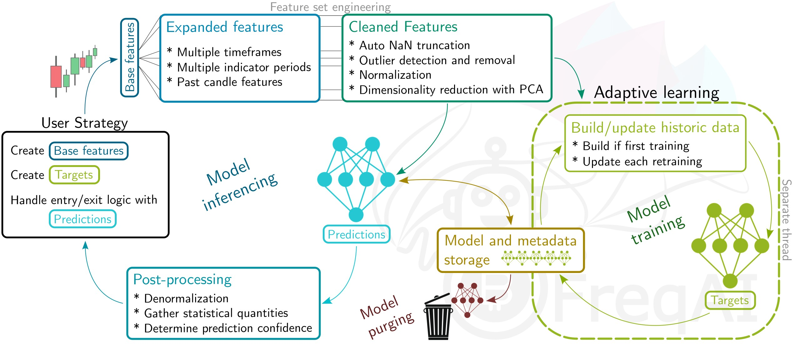

# FreqAI

## Introduction

FreqAI is a software designed to automate a variety of tasks associated with training a predictive machine learning model to generate market forecasts given a set of input signals. In general, FreqAI aims to be a sandbox for easily deploying robust machine learning libraries on real-time data ([details](#freqai-position-in-open-source-machine-learning-landscape)).

!!! Note
    FreqAI is, and always will be, a not-for-profit, open-source project. FreqAI does *not* have a crypto token, FreqAI does *not* sell signals, and FreqAI does not have a domain besides the present [freqtrade documentation](https://www.freqtrade.io/en/latest/freqai/).

Features include:

* **Self-adaptive retraining** - Retrain models during [live deployments](freqai-running.md#live-deployments) to self-adapt to the market in a supervised manner
* **Rapid feature engineering** - Create large rich [feature sets](freqai-feature-engineering.md#feature-engineering) (10k+ features) based on simple user-created strategies
* **High performance** - Threading allows for adaptive model retraining on a separate thread (or on GPU if available) from model inferencing (prediction) and bot trade operations. Newest models and data are kept in RAM for rapid inferencing
* **Realistic backtesting** - Emulate self-adaptive training on historic data with a [backtesting module](freqai-running.md#backtesting) that automates retraining
* **Extensibility** - The generalized and robust architecture allows for incorporating any [machine learning library/method](freqai-configuration.md#using-different-prediction-models) available in Python. Eight examples are currently available, including classifiers, regressors, and a convolutional neural network
* **Smart outlier removal** - Remove outliers from training and prediction data sets using a variety of [outlier detection techniques](freqai-feature-engineering.md#outlier-detection)
* **Crash resilience** - Store trained models to disk to make reloading from a crash fast and easy, and [purge obsolete files](freqai-running.md#purging-old-model-data) for sustained dry/live runs
* **Automatic data normalization** - [Normalize the data](freqai-feature-engineering.md#feature-normalization) in a smart and statistically safe way
* **Automatic data download** - Compute timeranges for data downloads and update historic data (in live deployments)
* **Cleaning of incoming data** - Handle NaNs safely before training and model inferencing
* **Dimensionality reduction** - Reduce the size of the training data via [Principal Component Analysis](freqai-feature-engineering.md#data-dimensionality-reduction-with-principal-component-analysis)
* **Deploying bot fleets** - Set one bot to train models while a fleet of [consumers](producer-consumer.md) use signals.

## Quick start

The easiest way to quickly test FreqAI is to run it in dry mode with the following command:

```bash
freqtrade trade --config config_examples/config_freqai.example.json --strategy FreqaiExampleStrategy --freqaimodel LightGBMRegressor --strategy-path freqtrade/templates
```

You will see the boot-up process of automatic data downloading, followed by simultaneous training and trading. 

!!! danger "Not for production"
    The example strategy provided with the Freqtrade source code is designed for showcasing/testing a wide variety of FreqAI features. It is also designed to run on small computers so that it can be used as a benchmark between developers and users. It is *not* designed to be run in production.

An example strategy, prediction model, and config to use as a starting points can be found in
`freqtrade/templates/FreqaiExampleStrategy.py`, `freqtrade/freqai/prediction_models/LightGBMRegressor.py`, and
`config_examples/config_freqai.example.json`, respectively.

## General approach

You provide FreqAI with a set of custom *base indicators* (the same way as in a [typical Freqtrade strategy](strategy-customization.md)) as well as target values (*labels*). For each pair in the whitelist, FreqAI trains a model to predict the target values based on the input of custom indicators. The models are then consistently retrained, with a predetermined frequency, to adapt to market conditions. FreqAI offers the ability to both backtest strategies (emulating reality with periodic retraining on historic data) and deploy dry/live runs. In dry/live conditions, FreqAI can be set to constant retraining in a background thread to keep models as up to date as possible.

An overview of the algorithm, explaining the data processing pipeline and model usage, is shown below.



### Important machine learning vocabulary

**Features** - the parameters, based on historic data, on which a model is trained. All features for a single candle are stored as a vector. In FreqAI, you build a feature data set from anything you can construct in the strategy.

**Labels** - the target values that the model is trained toward. Each feature vector is associated with a single label that is defined by you within the strategy. These labels intentionally look into the future and are what you are training the model to be able to predict.

**Training** - the process of "teaching" the model to match the feature sets to the associated labels. Different types of models "learn" in different ways which means that one might be better than another for a specific application. More information about the different models that are already implemented in FreqAI can be found [here](freqai-configuration.md#using-different-prediction-models).

**Train data** - a subset of the feature data set that is fed to the model during training to "teach" the model how to predict the targets. This data directly influences weight connections in the model.

**Test data** - a subset of the feature data set that is used to evaluate the performance of the model after training. This data does not influence nodal weights within the model.

**Inferencing** - the process of feeding a trained model new unseen data on which it will make a prediction. 

## Install prerequisites

The normal Freqtrade install process will ask if you wish to install FreqAI dependencies. You should reply "yes" to this question if you wish to use FreqAI. If you did not reply yes, you can manually install these dependencies after the install with:

``` bash
pip install -r requirements-freqai.txt
```

!!! Note
    Catboost will not be installed on low-powered arm devices (raspberry), since it does not provide wheels for this platform.

### Usage with docker

If you are using docker, a dedicated tag with FreqAI dependencies is available as `:freqai`. As such - you can replace the image line in your docker compose file with `image: freqtradeorg/freqtrade:develop_freqai`. This image contains the regular FreqAI dependencies. Similar to native installs, Catboost will not be available on ARM based devices. If you would like to use PyTorch or Reinforcement learning, you should use the torch or RL tags, `image: freqtradeorg/freqtrade:develop_freqaitorch`, `image: freqtradeorg/freqtrade:develop_freqairl`.

!!! note "docker-compose-freqai.yml"
   We do provide an explicit docker-compose file for this in `docker/docker-compose-freqai.yml` - which can be used via `docker compose -f docker/docker-compose-freqai.yml run ...` - or can be copied to replace the original docker file. This docker-compose file also contains a (disabled) section to enable GPU resources within docker containers. This obviously assumes the system has GPU resources available.

### FreqAI position in open-source machine learning landscape

Forecasting chaotic time-series based systems, such as equity/cryptocurrency markets, requires a broad set of tools geared toward testing a wide range of hypotheses. Fortunately, a recent maturation of robust machine learning libraries (e.g. `scikit-learn`) has opened up a wide range of research possibilities. Scientists from a diverse range of fields can now easily prototype their studies on an abundance of established machine learning algorithms. Similarly, these user-friendly libraries enable "citzen scientists" to use their basic Python skills for data exploration. However, leveraging these machine learning libraries on historical and live chaotic data sources can be logistically difficult and expensive. Additionally, robust data collection, storage, and handling presents a disparate challenge. [`FreqAI`](#freqai) aims to provide a generalized and extensible open-sourced framework geared toward live deployments of adaptive modeling for market forecasting. The `FreqAI` framework is effectively a sandbox for the rich world of open-source machine learning libraries. Inside the `FreqAI` sandbox, users find they can combine a wide variety of third-party libraries to test creative hypotheses on a free live 24/7 chaotic data source - cryptocurrency exchange data. 

### Citing FreqAI

FreqAI is [published in the Journal of Open Source Software](https://joss.theoj.org/papers/10.21105/joss.04864). If you find FreqAI useful in your research, please use the following citation:

```bibtex
@article{Caulk2022, 
    doi = {10.21105/joss.04864},
    url = {https://doi.org/10.21105/joss.04864},
    year = {2022}, publisher = {The Open Journal},
    volume = {7}, number = {80}, pages = {4864},
    author = {Robert A. Caulk and Elin Törnquist and Matthias Voppichler and Andrew R. Lawless and Ryan McMullan and Wagner Costa Santos and Timothy C. Pogue and Johan van der Vlugt and Stefan P. Gehring and Pascal Schmidt},
    title = {FreqAI: generalizing adaptive modeling for chaotic time-series market forecasts},
    journal = {Journal of Open Source Software} } 
```

## Common pitfalls

FreqAI cannot be combined with dynamic `VolumePairlists` (or any pairlist filter that adds and removes pairs dynamically).
This is for performance reasons - FreqAI relies on making quick predictions/retrains. To do this effectively,
it needs to download all the training data at the beginning of a dry/live instance. FreqAI stores and appends
new candles automatically for future retrains. This means that if new pairs arrive later in the dry run due to a volume pairlist, it will not have the data ready. However, FreqAI does work with the `ShufflePairlist` or a `VolumePairlist` which keeps the total pairlist constant (but reorders the pairs according to volume).

## Additional learning materials

Here we compile some external materials that provide deeper looks into various components of FreqAI:

- [Real-time head-to-head: Adaptive modeling of financial market data using XGBoost and CatBoost](https://emergentmethods.medium.com/real-time-head-to-head-adaptive-modeling-of-financial-market-data-using-xgboost-and-catboost-995a115a7495)
- [FreqAI - from price to prediction](https://emergentmethods.medium.com/freqai-from-price-to-prediction-6fadac18b665)

## Credits

FreqAI is developed by a group of individuals who all contribute specific skillsets to the project.

Conception and software development:
Robert Caulk @robcaulk

Theoretical brainstorming and data analysis:
Elin Törnquist @th0rntwig

Code review and software architecture brainstorming:
@xmatthias

Software development:
Wagner Costa @wagnercosta
Emre Suzen @aemr3
Timothy Pogue @wizrds

Beta testing and bug reporting:
Stefan Gehring @bloodhunter4rc, @longyu, Andrew Lawless @paranoidandy, Pascal Schmidt @smidelis, Ryan McMullan @smarmau, Juha Nykänen @suikula, Johan van der Vlugt @jooopiert, Richárd Józsa @richardjosza
