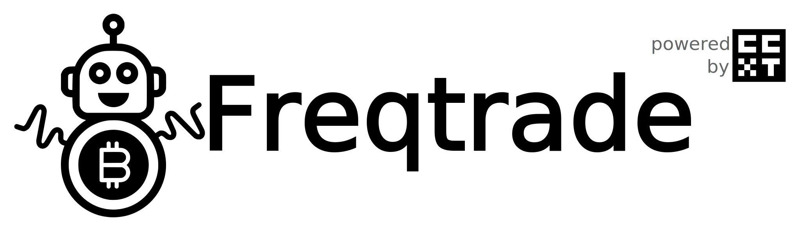
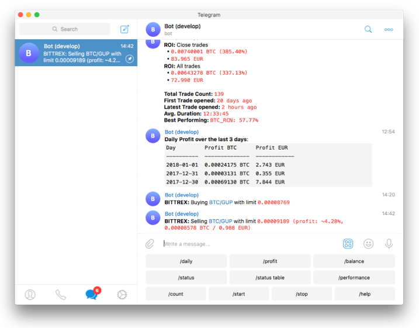

<!-- Place this tag where you want the button to render. -->
<a class="github-button" href="https://github.com/freqtrade/freqtrade" data-icon="octicon-star" data-size="large" aria-label="Star freqtrade/freqtrade on GitHub">Star</a>
<a class="github-button" href="https://github.com/freqtrade/freqtrade/fork" data-icon="octicon-repo-forked" data-size="large" aria-label="Fork freqtrade/freqtrade on GitHub">Fork</a>
<a class="github-button" href="https://github.com/freqtrade/freqtrade/archive/stable.zip" data-icon="octicon-cloud-download" data-size="large" aria-label="Download freqtrade/freqtrade on GitHub">Download</a>

## Introduction

Freqtrade is a free and open source crypto trading bot written in Python. It is designed to support all major exchanges and be controlled via Telegram or webUI. It contains backtesting, plotting and money management tools as well as strategy optimization by machine learning.

!!! Danger "DISCLAIMER"
    This software is for educational purposes only. Do not risk money which you are afraid to lose. USE THE SOFTWARE AT YOUR OWN RISK. THE AUTHORS AND ALL AFFILIATES ASSUME NO RESPONSIBILITY FOR YOUR TRADING RESULTS.

    Always start by running a trading bot in Dry-run and do not engage money before you understand how it works and what profit/loss you should expect.

    We strongly recommend you to have basic coding skills and Python knowledge. Do not hesitate to read the source code and understand the mechanisms of this bot, algorithms and techniques implemented in it.

## Features

- Develop your Strategy: Write your strategy in python, using [pandas](https://pandas.pydata.org/). Example strategies to inspire you are available in the [strategy repository](https://github.com/freqtrade/freqtrade-strategies).
- Download market data: Download historical data of the exchange and the markets your may want to trade with.
- Backtest: Test your strategy on downloaded historical data.
- Optimize: Find the best parameters for your strategy using hyperoptimization which employs machining learning methods. You can optimize buy, sell, take profit (ROI), stop-loss and trailing stop-loss parameters for your strategy.
- Select markets: Create your static list or use an automatic one based on top traded volumes and/or prices (not available during backtesting). You can also explicitly blacklist markets you don't want to trade.
- Run: Test your strategy with simulated money (Dry-Run mode) or deploy it with real money (Live-Trade mode).
- Run using Edge (optional module): The concept is to find the best historical [trade expectancy](edge.md#expectancy) by markets based on variation of the stop-loss and then allow/reject markets to trade. The sizing of the trade is based on a risk of a percentage of your capital.
- Control/Monitor: Use Telegram or a WebUI (start/stop the bot, show profit/loss, daily summary, current open trades results, etc.).
- Analyze: Further analysis can be performed on either Backtesting data or Freqtrade trading history (SQL database), including automated standard plots, and methods to load the data into [interactive environments](data-analysis.md).

## Supported exchange marketplaces

Please read the [exchange specific notes](exchanges.md) to learn about eventual, special configurations needed for each exchange.

- [X] [Binance](https://www.binance.com/)
- [X] [Bitmart](https://bitmart.com/)
- [X] [Gate.io](https://www.gate.io/ref/6266643)
- [X] [HTX](https://www.htx.com/) (Former Huobi)
- [X] [Kraken](https://kraken.com/)
- [X] [OKX](https://okx.com/) (Former OKEX)
- [ ] [potentially many others through ](https://github.com/ccxt/ccxt/). _(We cannot guarantee they will work)_

### Supported Futures Exchanges (experimental)

- [X] [Binance](https://www.binance.com/)
- [X] [Gate.io](https://www.gate.io/ref/6266643)
- [X] [OKX](https://okx.com/)
- [X] [Bybit](https://bybit.com/)

Please make sure to read the [exchange specific notes](exchanges.md), as well as the [trading with leverage](leverage.md) documentation before diving in.

### Community tested

Exchanges confirmed working by the community:

- [X] [Bitvavo](https://bitvavo.com/)
- [X] [Kucoin](https://www.kucoin.com/)

## Community showcase

--8<-- "includes/showcase.md"

## Requirements

### Hardware requirements

To run this bot we recommend you a linux cloud instance with a minimum of:

- 2GB RAM
- 1GB disk space
- 2vCPU

### Software requirements

- Docker (Recommended)

Alternatively

- Python 3.9+
- pip (pip3)
- git
- TA-Lib
- virtualenv (Recommended)

## Support

### Help / Discord

For any questions not covered by the documentation or for further information about the bot, or to simply engage with like-minded individuals, we encourage you to join the Freqtrade [discord server](https://discord.gg/p7nuUNVfP7).

## Ready to try?

Begin by reading the installation guide [for docker](docker_quickstart.md) (recommended), or for [installation without docker](installation.md).
