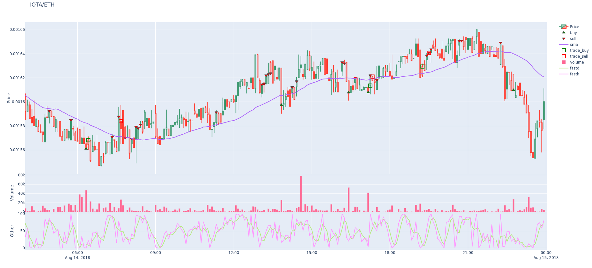
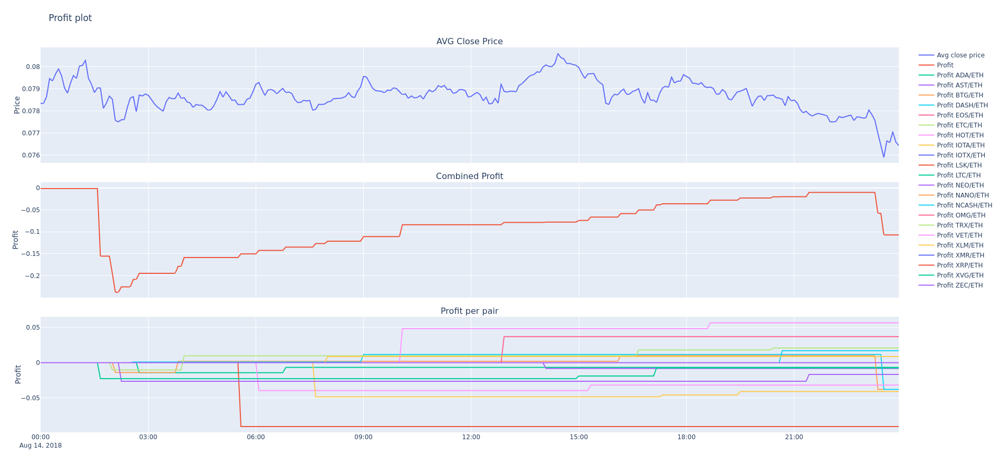

# Plotting

This page explains how to plot prices, indicators and profits.

## Installation / Setup

Plotting modules use the Plotly library. You can install / upgrade this by running the following command:

``` bash
pip install -U -r requirements-plot.txt
```

## Plot price and indicators

The `freqtrade plot-dataframe` subcommand shows an interactive graph with three subplots:

* Main plot with candlestics and indicators following price (sma/ema)
* Volume bars
* Additional indicators as specified by `--indicators2`



Possible arguments:

```
usage: freqtrade plot-dataframe [-h] [-v] [--logfile FILE] [-V] [-c PATH]
                                [-d PATH] [--userdir PATH] [-s NAME]
                                [--strategy-path PATH] [-p PAIRS [PAIRS ...]]
                                [--indicators1 INDICATORS1 [INDICATORS1 ...]]
                                [--indicators2 INDICATORS2 [INDICATORS2 ...]]
                                [--plot-limit INT] [--db-url PATH]
                                [--trade-source {DB,file}] [--export EXPORT]
                                [--export-filename PATH]
                                [--timerange TIMERANGE] [-i TIMEFRAME]
                                [--no-trades]

optional arguments:
  -h, --help            show this help message and exit
  -p PAIRS [PAIRS ...], --pairs PAIRS [PAIRS ...]
                        Limit command to these pairs. Pairs are space-
                        separated.
  --indicators1 INDICATORS1 [INDICATORS1 ...]
                        Set indicators from your strategy you want in the
                        first row of the graph. Space-separated list. Example:
                        `ema3 ema5`. Default: `['sma', 'ema3', 'ema5']`.
  --indicators2 INDICATORS2 [INDICATORS2 ...]
                        Set indicators from your strategy you want in the
                        third row of the graph. Space-separated list. Example:
                        `fastd fastk`. Default: `['macd', 'macdsignal']`.
  --plot-limit INT      Specify tick limit for plotting. Notice: too high
                        values cause huge files. Default: 750.
  --db-url PATH         Override trades database URL, this is useful in custom
                        deployments (default: `sqlite:///tradesv3.sqlite` for
                        Live Run mode, `sqlite:///tradesv3.dryrun.sqlite` for
                        Dry Run).
  --trade-source {DB,file}
                        Specify the source for trades (Can be DB or file
                        (backtest file)) Default: file
  --export EXPORT       Export backtest results, argument are: trades.
                        Example: `--export=trades`
  --export-filename PATH
                        Save backtest results to the file with this filename.
                        Requires `--export` to be set as well. Example:
                        `--export-filename=user_data/backtest_results/backtest
                        _today.json`
  --timerange TIMERANGE
                        Specify what timerange of data to use.
  -i TIMEFRAME, --timeframe TIMEFRAME, --ticker-interval TIMEFRAME
                        Specify timeframe (`1m`, `5m`, `30m`, `1h`, `1d`).
  --no-trades           Skip using trades from backtesting file and DB.

Common arguments:
  -v, --verbose         Verbose mode (-vv for more, -vvv to get all messages).
  --logfile FILE        Log to the file specified. Special values are:
                        'syslog', 'journald'. See the documentation for more
                        details.
  -V, --version         show program's version number and exit
  -c PATH, --config PATH
                        Specify configuration file (default:
                        `userdir/config.json` or `config.json` whichever
                        exists). Multiple --config options may be used. Can be
                        set to `-` to read config from stdin.
  -d PATH, --datadir PATH
                        Path to directory with historical backtesting data.
  --userdir PATH, --user-data-dir PATH
                        Path to userdata directory.

Strategy arguments:
  -s NAME, --strategy NAME
                        Specify strategy class name which will be used by the
                        bot.
  --strategy-path PATH  Specify additional strategy lookup path.

```

Example:

``` bash
freqtrade plot-dataframe -p BTC/ETH
```

The `-p/--pairs` argument can be used to specify pairs you would like to plot.

!!! Note
    The `freqtrade plot-dataframe` subcommand generates one plot-file per pair.

Specify custom indicators.
Use `--indicators1` for the main plot and `--indicators2` for the subplot below (if values are in a different range than prices).

!!! Tip
    You will almost certainly want to specify a custom strategy! This can be done by adding `-s Classname` / `--strategy ClassName` to the command.

``` bash
freqtrade plot-dataframe --strategy AwesomeStrategy -p BTC/ETH --indicators1 sma ema --indicators2 macd
```

### Further usage examples

To plot multiple pairs, separate them with a space:

``` bash
freqtrade plot-dataframe --strategy AwesomeStrategy -p BTC/ETH XRP/ETH
```

To plot a timerange (to zoom in)

``` bash
freqtrade plot-dataframe --strategy AwesomeStrategy -p BTC/ETH --timerange=20180801-20180805
```

To plot trades stored in a database use `--db-url` in combination with `--trade-source DB`:

``` bash
freqtrade plot-dataframe --strategy AwesomeStrategy --db-url sqlite:///tradesv3.dry_run.sqlite -p BTC/ETH --trade-source DB
```

To plot trades from a backtesting result, use `--export-filename <filename>`

``` bash
freqtrade plot-dataframe --strategy AwesomeStrategy --export-filename user_data/backtest_results/backtest-result.json -p BTC/ETH
```

### Plot dataframe basics


The `plot-dataframe` subcommand requires backtesting data, a strategy and either a backtesting-results file or a database, containing trades corresponding to the strategy.

The resulting plot will have the following elements:

* Green triangles: Buy signals from the strategy. (Note: not every buy signal generates a trade, compare to cyan circles.)
* Red triangles: Sell signals from the strategy. (Also, not every sell signal terminates a trade, compare to red and green squares.)
* Cyan circles: Trade entry points.
* Red squares: Trade exit points for trades with loss or 0% profit.
* Green squares: Trade exit points for profitable trades.
* Indicators with values corresponding to the candle scale (e.g. SMA/EMA), as specified with `--indicators1`.
* Volume (bar chart at the bottom of the main chart).
* Indicators with values in different scales (e.g. MACD, RSI) below the volume bars, as specified with `--indicators2`.

!!! Note "Bollinger Bands"
    Bollinger bands are automatically added to the plot if the columns `bb_lowerband` and `bb_upperband` exist, and are painted as a light blue area spanning from the lower band to the upper band.

#### Advanced plot configuration

An advanced plot configuration can be specified in the strategy in the `plot_config` parameter.

Additional features when using plot_config include:

* Specify colors per indicator
* Specify additional subplots
* Specify indicator pairs to fill area in between 

The sample plot configuration below specifies fixed colors for the indicators. Otherwise, consecutive plots may produce different color schemes each time, making comparisons difficult.
It also allows multiple subplots to display both MACD and RSI at the same time.

Plot type can be configured using `type` key. Possible types are:
* `scatter` corresponding to `plotly.graph_objects.Scatter` class (default).
* `bar` corresponding to `plotly.graph_objects.Bar` class.

Extra parameters to `plotly.graph_objects.*` constructor can be specified in `plotly` dict.

Sample configuration with inline comments explaining the process:

``` python
    plot_config = {
        'main_plot': {
            # Configuration for main plot indicators.
            # Specifies `ema10` to be red, and `ema50` to be a shade of gray
            'ema10': {'color': 'red'},
            'ema50': {'color': '#CCCCCC'},
            # By omitting color, a random color is selected.
            'sar': {},
	    # fill area between senkou_a and senkou_b
	    'senkou_a': {
	        'color': 'green', #optional
	        'fill_to': 'senkou_b',
	        'fill_label': 'Ichimoku Cloud', #optional
	        'fill_color': 'rgba(255,76,46,0.2)', #optional
	    },
	    # plot senkou_b, too. Not only the area to it.
	    'senkou_b': {}
        },
        'subplots': {
            # Create subplot MACD
            "MACD": {
                'macd': {'color': 'blue', 'fill_to': 'macdhist'},
                'macdsignal': {'color': 'orange'},
                'macdhist': {'type': 'bar', 'plotly': {'opacity': 0.9}}
            },
            # Additional subplot RSI
            "RSI": {
                'rsi': {'color': 'red'}
            }
        }
    }

```

!!! Note
    The above configuration assumes that `ema10`, `ema50`, `senkou_a`, `senkou_b`,
    `macd`, `macdsignal`, `macdhist` and `rsi` are columns in the DataFrame created by the strategy.

!!! Warning
    `plotly` arguments are only supported with plotly library and will not work with freq-ui.

## Plot profit



The `plot-profit` subcommand shows an interactive graph with three plots:

* Average closing price for all pairs.
* The summarized profit made by backtesting.
Note that this is not the real-world profit, but more of an estimate.
* Profit for each individual pair.

The first graph is good to get a grip of how the overall market progresses.

The second graph will show if your algorithm works or doesn't.
Perhaps you want an algorithm that steadily makes small profits, or one that acts less often, but makes big swings.
This graph will also highlight the start (and end) of the Max drawdown period.

The third graph can be useful to spot outliers, events in pairs that cause profit spikes.

Possible options for the `freqtrade plot-profit` subcommand:

```
usage: freqtrade plot-profit [-h] [-v] [--logfile FILE] [-V] [-c PATH]
                             [-d PATH] [--userdir PATH] [-s NAME]
                             [--strategy-path PATH] [-p PAIRS [PAIRS ...]]
                             [--timerange TIMERANGE] [--export EXPORT]
                             [--export-filename PATH] [--db-url PATH]
                             [--trade-source {DB,file}] [-i TIMEFRAME]

optional arguments:
  -h, --help            show this help message and exit
  -p PAIRS [PAIRS ...], --pairs PAIRS [PAIRS ...]
                        Limit command to these pairs. Pairs are space-
                        separated.
  --timerange TIMERANGE
                        Specify what timerange of data to use.
  --export EXPORT       Export backtest results, argument are: trades.
                        Example: `--export=trades`
  --export-filename PATH
                        Save backtest results to the file with this filename.
                        Requires `--export` to be set as well. Example:
                        `--export-filename=user_data/backtest_results/backtest
                        _today.json`
  --db-url PATH         Override trades database URL, this is useful in custom
                        deployments (default: `sqlite:///tradesv3.sqlite` for
                        Live Run mode, `sqlite:///tradesv3.dryrun.sqlite` for
                        Dry Run).
  --trade-source {DB,file}
                        Specify the source for trades (Can be DB or file
                        (backtest file)) Default: file
  -i TIMEFRAME, --timeframe TIMEFRAME, --ticker-interval TIMEFRAME
                        Specify timeframe (`1m`, `5m`, `30m`, `1h`, `1d`).
  --auto-open           Automatically open generated plot.

Common arguments:
  -v, --verbose         Verbose mode (-vv for more, -vvv to get all messages).
  --logfile FILE        Log to the file specified. Special values are:
                        'syslog', 'journald'. See the documentation for more
                        details.
  -V, --version         show program's version number and exit
  -c PATH, --config PATH
                        Specify configuration file (default:
                        `userdir/config.json` or `config.json` whichever
                        exists). Multiple --config options may be used. Can be
                        set to `-` to read config from stdin.
  -d PATH, --datadir PATH
                        Path to directory with historical backtesting data.
  --userdir PATH, --user-data-dir PATH
                        Path to userdata directory.

Strategy arguments:
  -s NAME, --strategy NAME
                        Specify strategy class name which will be used by the
                        bot.
  --strategy-path PATH  Specify additional strategy lookup path.

```

The `-p/--pairs`  argument, can be used to limit the pairs that are considered for this calculation.

Examples:

Use custom backtest-export file

``` bash
freqtrade plot-profit  -p LTC/BTC --export-filename user_data/backtest_results/backtest-result.json
```

Use custom database

``` bash
freqtrade plot-profit  -p LTC/BTC --db-url sqlite:///tradesv3.sqlite --trade-source DB
```

``` bash
freqtrade --datadir user_data/data/binance_save/ plot-profit -p LTC/BTC
```
