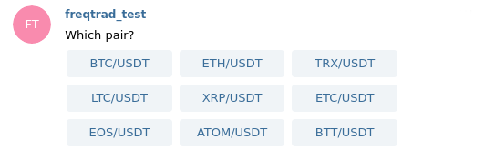

# Telegram usage

## Setup your Telegram bot

Below we explain how to create your Telegram Bot, and how to get your
Telegram user id.

### 1. Create your Telegram bot

Start a chat with the [Telegram BotFather](https://telegram.me/BotFather)

Send the message `/newbot`.

*BotFather response:*

> Alright, a new bot. How are we going to call it? Please choose a name for your bot.

Choose the public name of your bot (e.x. `Freqtrade bot`)

*BotFather response:*

> Good. Now let's choose a username for your bot. It must end in `bot`. Like this, for example: TetrisBot or tetris_bot.

Choose the name id of your bot and send it to the BotFather (e.g. "`My_own_freqtrade_bot`")

*BotFather response:*

> Done! Congratulations on your new bot. You will find it at `t.me/yourbots_name_bot`. You can now add a description, about section and profile picture for your bot, see /help for a list of commands. By the way, when you've finished creating your cool bot, ping our Bot Support if you want a better username for it. Just make sure the bot is fully operational before you do this.

> Use this token to access the HTTP API: `22222222:APITOKEN`

> For a description of the Bot API, see this page: https://core.telegram.org/bots/api Father bot will return you the token (API key)

Copy the API Token (`22222222:APITOKEN` in the above example) and keep use it for the config parameter `token`.

Don't forget to start the conversation with your bot, by clicking `/START` button

### 2. Telegram user_id

#### Get your user id

Talk to the [userinfobot](https://telegram.me/userinfobot)

Get your "Id", you will use it for the config parameter `chat_id`.

#### Use Group id

You can use bots in telegram groups by just adding them to the group. You can find the group id by first adding a [RawDataBot](https://telegram.me/rawdatabot) to your group. The Group id is shown as id in the `"chat"` section, which the RawDataBot will send to you:

``` json
"chat":{
   "id":-1001332619709
}
```

For the Freqtrade configuration, you can then use the the full value (including `-` if it's there) as string:

```json
   "chat_id": "-1001332619709"
```
!!! Warning "Using telegram groups"
    When using telegram groups, you're giving every member of the telegram group access to your freqtrade bot and to all commands possible via telegram. Please make sure that you can trust everyone in the telegram group to avoid unpleasent surprises.

## Control telegram noise

Freqtrade provides means to control the verbosity of your telegram bot.
Each setting has the following possible values:

* `on` - Messages will be sent, and user will be notified.
* `silent` - Message will be sent, Notification will be without sound / vibration.
* `off` - Skip sending a message-type all together.

Example configuration showing the different settings:

``` json
"telegram": {
    "enabled": true,
    "token": "your_telegram_token",
    "chat_id": "your_telegram_chat_id",
    "allow_custom_messages": true,
    "notification_settings": {
        "status": "silent",
        "warning": "on",
        "startup": "off",
        "entry": "silent",
        "entry_fill": "on",
        "entry_cancel": "silent",
        "exit": {
            "roi": "silent",
            "emergency_exit": "on",
            "force_exit": "on",
            "exit_signal": "silent",
            "trailing_stop_loss": "on",
            "stop_loss": "on",
            "stoploss_on_exchange": "on",
            "custom_exit": "silent",
            "partial_exit": "on"
        },
        "exit_cancel": "on",
        "exit_fill": "off",
        "protection_trigger": "off",
        "protection_trigger_global": "on",
        "strategy_msg": "off",
        "show_candle": "off"
    },
    "reload": true,
    "balance_dust_level": 0.01
},
```

`entry` notifications are sent when the order is placed, while `entry_fill` notifications are sent when the order is filled on the exchange.
`exit` notifications are sent when the order is placed, while `exit_fill` notifications are sent when the order is filled on the exchange.
`*_fill` notifications are off by default and must be explicitly enabled.
`protection_trigger` notifications are sent when a protection triggers and `protection_trigger_global` notifications trigger when global protections are triggered.
`strategy_msg` - Receive notifications from the strategy, sent via `self.dp.send_msg()` from the strategy [more details](strategy-customization.md#send-notification).
`show_candle` - show candle values as part of entry/exit messages. Only possible values are `"ohlc"` or `"off"`.

`balance_dust_level` will define what the `/balance` command takes as "dust" - Currencies with a balance below this will be shown.
`allow_custom_messages` completely disable strategy messages.
`reload` allows you to disable reload-buttons on selected messages.

## Create a custom keyboard (command shortcut buttons)

Telegram allows us to create a custom keyboard with buttons for commands.
The default custom keyboard looks like this.

```python
[
    ["/daily", "/profit", "/balance"], # row 1, 3 commands
    ["/status", "/status table", "/performance"], # row 2, 3 commands
    ["/count", "/start", "/stop", "/help"] # row 3, 4 commands
]
```

### Usage

You can create your own keyboard in `config.json`:

``` json
"telegram": {
      "enabled": true,
      "token": "your_telegram_token",
      "chat_id": "your_telegram_chat_id",
      "keyboard": [
          ["/daily", "/stats", "/balance", "/profit"],
          ["/status table", "/performance"],
          ["/reload_config", "/count", "/logs"]
      ]
   },
```

!!! Note "Supported Commands"
    Only the following commands are allowed. Command arguments are not supported!

    `/start`, `/stop`, `/status`, `/status table`, `/trades`, `/profit`, `/performance`, `/daily`, `/stats`, `/count`, `/locks`, `/balance`, `/stopentry`, `/reload_config`, `/show_config`, `/logs`, `/whitelist`, `/blacklist`, `/edge`, `/help`, `/version`

## Telegram commands

Per default, the Telegram bot shows predefined commands. Some commands
are only available by sending them to the bot. The table below list the
official commands. You can ask at any moment for help with `/help`.

|  Command | Description |
|----------|-------------|
| `/start` | Starts the trader
| `/stop` | Stops the trader
| `/stopbuy | /stopentry` | Stops the trader from opening new trades. Gracefully closes open trades according to their rules.
| `/reload_config` | Reloads the configuration file
| `/show_config` | Shows part of the current configuration with relevant settings to operation
| `/logs [limit]` | Show last log messages.
| `/status` | Lists all open trades
| `/status <trade_id>` | Lists one or more specific trade. Separate multiple <trade_id> with a blank space.
| `/status table` | List all open trades in a table format. Pending buy orders are marked with an asterisk (*) Pending sell orders are marked with a double asterisk (**)
| `/trades [limit]` | List all recently closed trades in a table format.
| `/delete <trade_id>` | Delete a specific trade from the Database. Tries to close open orders. Requires manual handling of this trade on the exchange.
| `/count` | Displays number of trades used and available
| `/locks` | Show currently locked pairs.
| `/unlock <pair or lock_id>` | Remove the lock for this pair (or for this lock id).
| `/profit [<n>]` | Display a summary of your profit/loss from close trades and some stats about your performance, over the last n days (all trades by default)
| `/forceexit <trade_id> | /fx <tradeid>` | Instantly exits the given trade  (Ignoring `minimum_roi`).
| `/forceexit all | /fx all` | Instantly exits all open trades (Ignoring `minimum_roi`).
| `/fx` | alias for `/forceexit`
| `/forcelong <pair> [rate]` | Instantly buys the given pair. Rate is optional and only applies to limit orders. (`force_entry_enable` must be set to True)
| `/forceshort <pair> [rate]` | Instantly shorts the given pair. Rate is optional and only applies to limit orders. This will only work on non-spot markets. (`force_entry_enable` must be set to True)
| `/performance` | Show performance of each finished trade grouped by pair
| `/balance` | Show account balance per currency
| `/daily <n>` | Shows profit or loss per day, over the last n days (n defaults to 7)
| `/weekly <n>` | Shows profit or loss per week, over the last n weeks (n defaults to 8)
| `/monthly <n>` | Shows profit or loss per month, over the last n months (n defaults to 6)
| `/stats` | Shows Wins / losses by Exit reason as well as Avg. holding durations for buys and sells
| `/exits` | Shows Wins / losses by Exit reason as well as Avg. holding durations for buys and sells
| `/entries` | Shows Wins / losses by Exit reason as well as Avg. holding durations for buys and sells
| `/whitelist [sorted] [baseonly]` | Show the current whitelist. Optionally display in alphabetical order and/or with just the base currency of each pairing.
| `/blacklist [pair]` | Show the current blacklist, or adds a pair to the blacklist.
| `/edge` | Show validated pairs by Edge if it is enabled.
| `/help` | Show help message
| `/version` | Show version

## Telegram commands in action

Below, example of Telegram message you will receive for each command.

### /start

> **Status:** `running`

### /stop

> `Stopping trader ...`
> **Status:** `stopped`

### /stopbuy

> **status:** `Setting max_open_trades to 0. Run /reload_config to reset.`

Prevents the bot from opening new trades by temporarily setting "max_open_trades" to 0. Open trades will be handled via their regular rules (ROI / Sell-signal, stoploss, ...).

After this, give the bot time to close off open trades (can be checked via `/status table`).
Once all positions are sold, run `/stop` to completely stop the bot.

`/reload_config` resets "max_open_trades" to the value set in the configuration and resets this command.

!!! Warning
   The stop-buy signal is ONLY active while the bot is running, and is not persisted anyway, so restarting the bot will cause this to reset.

### /status

For each open trade, the bot will send you the following message.
Enter Tag is configurable via Strategy.

> **Trade ID:** `123` `(since 1 days ago)`
> **Current Pair:** CVC/BTC
> **Direction:** Long
> **Leverage:** 1.0
> **Amount:** `26.64180098`
> **Enter Tag:** Awesome Long Signal
> **Open Rate:** `0.00007489`
> **Current Rate:** `0.00007489`
> **Current Profit:** `12.95%`
> **Stoploss:** `0.00007389 (-0.02%)`

### /status table

Return the status of all open trades in a table format.

```
ID L/S    Pair     Since   Profit
----    --------  -------  --------
  67 L   SC/BTC    1 d      13.33%
 123 S   CVC/BTC   1 h      12.95%
```

### /count

Return the number of trades used and available.

```
current    max
---------  -----
     2     10
```

### /profit

Return a summary of your profit/loss and performance.

> **ROI:** Close trades
>   ∙ `0.00485701 BTC (2.2%) (15.2 Σ%)`
>   ∙ `62.968 USD`
> **ROI:** All trades
>   ∙ `0.00255280 BTC (1.5%) (6.43 Σ%)`
>   ∙ `33.095 EUR`
>
> **Total Trade Count:** `138`
> **First Trade opened:** `3 days ago`
> **Latest Trade opened:** `2 minutes ago`
> **Avg. Duration:** `2:33:45`
> **Best Performing:** `PAY/BTC: 50.23%`
> **Trading volume:** `0.5 BTC`
> **Profit factor:** `1.04`
> **Max Drawdown:** `9.23% (0.01255 BTC)`

The relative profit of `1.2%` is the average profit per trade.
The relative profit of `15.2 Σ%` is be based on the starting capital - so in this case, the starting capital was `0.00485701 * 1.152 = 0.00738 BTC`.
Starting capital is either taken from the `available_capital` setting, or calculated by using current wallet size - profits.
Profit Factor is calculated as gross profits / gross losses - and should serve as an overall metric for the strategy.
Max drawdown corresponds to the backtesting metric `Absolute Drawdown (Account)` - calculated as `(Absolute Drawdown) / (DrawdownHigh + startingBalance)`.

### /forceexit <trade_id>

> **BINANCE:** Exiting BTC/LTC with limit `0.01650000 (profit: ~-4.07%, -0.00008168)`

!!! Tip
    You can get a list of all open trades by calling `/forceexit` without parameter, which will show a list of buttons to simply exit a trade.
    This command has an alias in `/fx` - which has the same capabilities, but is faster to type in "emergency" situations.

### /forcelong <pair> [rate] | /forceshort <pair> [rate]

`/forcebuy <pair> [rate]` is also supported for longs but should be considered deprecated.

> **BINANCE:** Long ETH/BTC with limit `0.03400000` (`1.000000 ETH`, `225.290 USD`)

Omitting the pair will open a query asking for the pair to trade (based on the current whitelist).
Trades created through `/forcelong` will have the buy-tag of `force_entry`.



Note that for this to work, `force_entry_enable` needs to be set to true.

[More details](configuration.md#understand-force_entry_enable)

### /performance

Return the performance of each crypto-currency the bot has sold.
> Performance:
> 1. `RCN/BTC 0.003 BTC (57.77%) (1)`
> 2. `PAY/BTC 0.0012 BTC (56.91%) (1)`
> 3. `VIB/BTC 0.0011 BTC (47.07%) (1)`
> 4. `SALT/BTC 0.0010 BTC (30.24%) (1)`
> 5. `STORJ/BTC 0.0009 BTC (27.24%) (1)`
> ...

### /balance

Return the balance of all crypto-currency your have on the exchange.

> **Currency:** BTC
> **Available:** 3.05890234
> **Balance:** 3.05890234
> **Pending:** 0.0

> **Currency:** CVC
> **Available:** 86.64180098
> **Balance:** 86.64180098
> **Pending:** 0.0

### /daily <n>

Per default `/daily` will return the 7 last days. The example below if for `/daily 3`:

> **Daily Profit over the last 3 days:**
```
Day (count)     USDT          USD         Profit %
--------------  ------------  ----------  ----------
2022-06-11 (1)  -0.746 USDT   -0.75 USD   -0.08%
2022-06-10 (0)  0 USDT        0.00 USD    0.00%
2022-06-09 (5)  20 USDT       20.10 USD   5.00%
```

### /weekly <n>

Per default `/weekly` will return the 8 last weeks, including the current week. Each week starts
from Monday. The example below if for `/weekly 3`:

> **Weekly Profit over the last 3 weeks (starting from Monday):**
```
Monday (count)  Profit BTC      Profit USD   Profit %
-------------  --------------  ------------    ----------
2018-01-03 (5)  0.00224175 BTC  29,142 USD   4.98%
2017-12-27 (1)  0.00033131 BTC   4,307 USD   0.00%
2017-12-20 (4)  0.00269130 BTC  34.986 USD   5.12%
```

### /monthly <n>

Per default `/monthly` will return the 6 last months, including the current month. The example below
if for `/monthly 3`:

> **Monthly Profit over the last 3 months:**
```
Month (count)  Profit BTC      Profit USD    Profit %
-------------  --------------  ------------    ----------
2018-01 (20)    0.00224175 BTC  29,142 USD  4.98%
2017-12 (5)    0.00033131 BTC   4,307 USD   0.00%
2017-11 (10)    0.00269130 BTC  34.986 USD  5.10%
```

### /whitelist

Shows the current whitelist

> Using whitelist `StaticPairList` with 22 pairs
> `IOTA/BTC, NEO/BTC, TRX/BTC, VET/BTC, ADA/BTC, ETC/BTC, NCASH/BTC, DASH/BTC, XRP/BTC, XVG/BTC, EOS/BTC, LTC/BTC, OMG/BTC, BTG/BTC, LSK/BTC, ZEC/BTC, HOT/BTC, IOTX/BTC, XMR/BTC, AST/BTC, XLM/BTC, NANO/BTC`

### /blacklist [pair]

Shows the current blacklist.
If Pair is set, then this pair will be added to the pairlist.
Also supports multiple pairs, separated by a space.
Use `/reload_config` to reset the blacklist.

> Using blacklist `StaticPairList` with 2 pairs
>`DODGE/BTC`, `HOT/BTC`.

### /edge

Shows pairs validated by Edge along with their corresponding win-rate, expectancy and stoploss values.

> **Edge only validated following pairs:**
```
Pair        Winrate    Expectancy    Stoploss
--------  ---------  ------------  ----------
DOCK/ETH   0.522727      0.881821       -0.03
PHX/ETH    0.677419      0.560488       -0.03
HOT/ETH    0.733333      0.490492       -0.03
HC/ETH     0.588235      0.280988       -0.02
ARDR/ETH   0.366667      0.143059       -0.01
```

### /version

> **Version:** `0.14.3`
