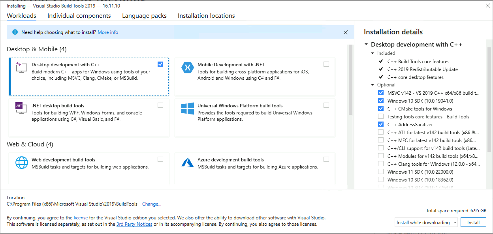

# Windows installation

We **strongly** recommend that Windows users use [Docker](docker_quickstart.md) as this will work much easier and smoother (also more secure).

If that is not possible, try using the Windows Linux subsystem (WSL) - for which the Ubuntu instructions should work.
Otherwise, please follow the instructions below.

All instructions assume that python 3.10+ is installed and available.

## Clone the git repository

First of all clone the repository by running:

``` powershell
git clone https://github.com/freqtrade/freqtrade.git
```

Now, choose your installation method, either automatically via script (recommended) or manually following the corresponding instructions.

## Install freqtrade automatically

### Run the installation script

The script will ask you a few questions to determine which parts should be installed.

```powershell
Set-ExecutionPolicy -ExecutionPolicy Bypass
cd freqtrade
. .\setup.ps1
```

## Install freqtrade manually

!!! Note "64bit Python version"
    Please make sure to use 64bit Windows and 64bit Python to avoid problems with backtesting or hyperopt due to the memory constraints 32bit applications have under Windows.
    32bit python versions are no longer supported under Windows.

!!! Hint
    Using the [Anaconda Distribution](https://www.anaconda.com/distribution/) under Windows can greatly help with installation problems. Check out the [Anaconda installation section](installation.md#installation-with-conda) in the documentation for more information.

### Install ta-lib

Install ta-lib according to the [ta-lib documentation](https://github.com/TA-Lib/ta-lib-python#windows).

As compiling from source on windows has heavy dependencies (requires a partial visual studio installation), Freqtrade provides these dependencies (in the binary wheel format) for the latest 3 Python versions (3.10, 3.11 and 3.12) and for 64bit Windows.
These Wheels are also used by CI running on windows, and are therefore tested together with freqtrade.

Other versions must be downloaded from the above link.

``` powershell
cd \path\freqtrade
python -m venv .venv
.venv\Scripts\activate.ps1
# optionally install ta-lib from wheel
# Eventually adjust the below filename to match the downloaded wheel
pip install --find-links build_helpers\ TA-Lib -U
pip install -r requirements.txt
pip install -e .
freqtrade
```

!!! Note "Use Powershell"
    The above installation script assumes you're using powershell on a 64bit windows.
    Commands for the legacy CMD windows console may differ.

### Error during installation on Windows

``` bash
error: Microsoft Visual C++ 14.0 is required. Get it with "Microsoft Visual C++ Build Tools": http://landinghub.visualstudio.com/visual-cpp-build-tools
```

Unfortunately, many packages requiring compilation don't provide a pre-built wheel. It is therefore mandatory to have a C/C++ compiler installed and available for your python environment to use.

You can download the Visual C++ build tools from [here](https://visualstudio.microsoft.com/visual-cpp-build-tools/) and install "Desktop development with C++" in it's default configuration. Unfortunately, this is a heavy download / dependency so you might want to consider WSL2 or [docker compose](docker_quickstart.md) first.



---
